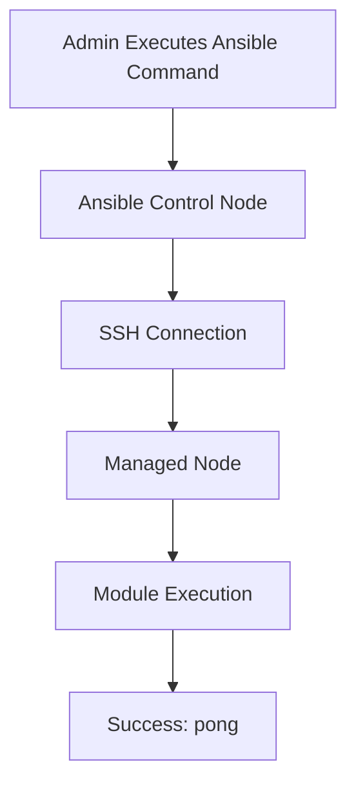

# Lab 01: Ansible Installation and Basic Connectivity

## Objective

Install Ansible on a control node, configure the inventory file, and verify communication with managed nodes using the Ansible ping module.

By the end of this lab, you will be able to:

- Understand Infrastructure as Code (IaC)
- Understand Ansible architecture
- Install Ansible
- Configure an inventory file
- Verify connectivity to managed nodes
- Understand why Ansible is widely used in DevOps

---

# What is Ansible?

Ansible is an open-source automation tool used for:

- Server configuration
- Application deployment
- Infrastructure provisioning
- Security configuration
- Orchestration

Instead of manually logging into servers and executing commands, Ansible allows infrastructure to be managed as code.

---

# Why Do We Need Ansible?

Imagine an organization with:

```text
10 Servers
```

Manually updating each server:

```text
SSH Server 1
Install Package

SSH Server 2
Install Package

SSH Server 3
Install Package
```

This quickly becomes inefficient.

Now imagine:

```text
100 Servers
```

Manual administration becomes nearly impossible.

Ansible solves this problem.

---

# Traditional Administration

```text
Admin
  ↓
Server 1
Server 2
Server 3
Server 4
...
```

Each server must be managed individually.

---

# Ansible Administration

```text
Admin
   ↓
Ansible Control Node
   ↓
All Servers
```

One command can configure hundreds of servers simultaneously.

---

# What is Infrastructure as Code (IaC)?

Infrastructure as Code means managing infrastructure using code files rather than manual actions.

Example:

Instead of manually installing Nginx:

```bash
sudo apt install nginx
```

on multiple servers.

Create a playbook:

```yaml
- name: Install nginx
  hosts: web
  tasks:
    - apt:
        name: nginx
        state: present
```

Now infrastructure becomes:

- Repeatable
- Version controlled
- Automated
- Auditable

---

# Ansible Architecture

Ansible consists of:

## 1. Control Node

The machine where Ansible is installed.

Example:

```text
Admin Laptop
Jenkins Server
Management Server
```

---

## 2. Managed Nodes

The servers being controlled.

Examples:

```text
web01
web02
db01
db02
```

---

## Architecture Diagram

```text
                Control Node
             (Ansible Installed)
                       │
        ┌──────────────┼──────────────┐
        │              │              │
        ▼              ▼              ▼
      Web01         Web02           DB01
```

---

# Agentless Architecture

One major advantage of Ansible:

```text
No Agent Required
```

Unlike some tools:

```text
Chef
Puppet
SaltStack
```

Ansible only requires:

```text
SSH Access
```

on target servers.

---

# How Ansible Communicates

When a playbook runs:

```text
Ansible
   ↓
SSH
   ↓
Remote Server
   ↓
Execute Task
```

No additional software needs to run continuously on target systems.

---

# Installing Ansible

Update repositories:

```bash
sudo apt update
```

Install Ansible:

```bash
sudo apt install ansible -y
```

---

# Verify Installation

Check version:

```bash
ansible --version
```

Example:

```text
ansible [core 2.x]
```

This confirms installation.

---

# Ansible Inventory

Ansible needs a list of servers it can manage.

This list is called:

```text
Inventory
```

Default inventory file:

```bash
/etc/ansible/hosts
```

---

# Example Inventory

```ini
[web]
192.168.1.10
192.168.1.11

[db]
192.168.1.20

[all_servers]
192.168.1.10
192.168.1.11
192.168.1.20
```

---

# Why Group Servers?

Grouping simplifies automation.

Example:

```text
[web]
```

Apply web-server configurations.

Example:

```text
[db]
```

Apply database configurations.

---

# Testing Connectivity

Run:

```bash
ansible all -m ping
```

---

# Understanding This Command

```bash
ansible all -m ping
```

### ansible

Ansible CLI tool.

---

### all

Target every host in inventory.

---

### -m

Specifies a module.

---

### ping

Ansible ping module.

This does NOT use ICMP ping.

Instead it verifies:

```text
SSH Connectivity
Python Availability
Ansible Access
```

---

# Expected Output

```json
web01 | SUCCESS => {
    "changed": false,
    "ping": "pong"
}
```

Success means:

```text
SSH Working
Authentication Working
Host Reachable
```

---

# Why "pong"?

The ping module simply returns:

```json
"ping": "pong"
```

This confirms the managed node is accessible.

---

# SSH Requirements

Ansible depends heavily on SSH.

You must have:

```bash
ssh-keygen
ssh-copy-id
```

configured beforehand.

Example:

```bash
ssh-copy-id ubuntu@192.168.1.10
```

Once SSH works:

```bash
ssh ubuntu@192.168.1.10
```

Ansible usually works too.

---

# Real-World Example

Suppose a company has:

```text
50 Web Servers
20 Database Servers
10 Monitoring Servers
```

Requirement:

```text
Install Vim On Every Server
```

Without Ansible:

```text
80 Manual Logins
80 Install Commands
```

With Ansible:

```bash
ansible all -m apt -a "name=vim state=present" -b
```

One command.

All systems updated.

---

# Troubleshooting Ansible Connectivity

## Scenario 1: Host Unreachable

Error:

```text
UNREACHABLE!
```

Check:

```bash
ssh user@server
```

SSH must work first.

---

## Scenario 2: Permission Denied

Error:

```text
Permission denied (publickey)
```

Verify SSH keys.

Test:

```bash
ssh user@server
```

---

## Scenario 3: Host Not Found

Check inventory:

```bash
cat /etc/ansible/hosts
```

Ensure:

```text
IP address correct
Hostname correct
```

---

## Scenario 4: Python Missing

Error:

```text
Python interpreter not found
```

Install Python:

```bash
sudo apt install python3 -y
```

Ansible requires Python on managed nodes.

---

## Scenario 5: Verify Inventory

Show inventory:

```bash
ansible-inventory --list
```

Useful for troubleshooting group definitions.

---

# Workflow Diagram



---

# Command Summary

Install Ansible:

```bash
sudo apt update
sudo apt install ansible -y
```

Verify installation:

```bash
ansible --version
```

Edit inventory:

```bash
sudo vi /etc/ansible/hosts
```

Test connectivity:

```bash
ansible all -m ping
```

View inventory:

```bash
ansible-inventory --list
```

---

# Key Learnings

- Ansible is an Infrastructure as Code (IaC) tool.
- Ansible automates server management.
- Ansible uses a control node and managed nodes.
- Ansible 
