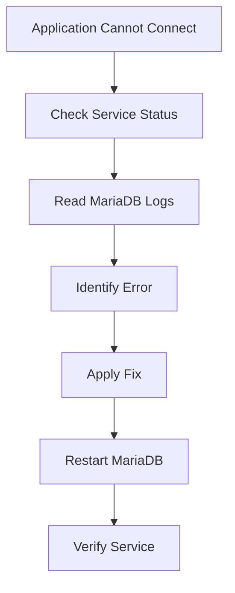

# Lab 02: MariaDB Troubleshooting

## Objective

Learn how to troubleshoot a MariaDB database service that fails to start or refuses client connections.

This lab introduces one of the most important responsibilities of a Linux Administrator and DevOps Engineer:

```text
Troubleshooting Production Incidents
```

By the end of this lab, you will be able to:

- Check MariaDB service status
- Read MariaDB logs
- Identify startup failures
- Investigate connection issues
- Use systemd and journalctl for troubleshooting
- Follow a structured troubleshooting methodology

---

# Why Is This Important?

Databases are the heart of most applications.

Example:

```text
Web Application
      ↓
API Server
      ↓
MariaDB
```

If the database stops working:

```text
Users Cannot Login
Transactions Fail
Reports Stop Working
Applications Crash
```

As a DevOps Engineer, your job is not just to run services.

Your job is to identify:

```text
Why did it fail?
```

---

# Understanding MariaDB

MariaDB is an open-source relational database management system.

It is a drop-in replacement for MySQL.

Common uses:

- Web applications
- Backend services
- ERP systems
- Monitoring tools
- CI/CD applications

Examples:

```text
WordPress
GitLab
Jira
MediaWiki
```

---

# Understanding systemd Services

MariaDB runs as a Linux service.

Check status:

```bash
systemctl status mariadb
```

Possible states:

```text
active (running)
```

Service is healthy.

---

```text
failed
```

Service failed.

---

```text
inactive
```

Service stopped.

---

# First Rule of Troubleshooting

Always start with:

```bash
systemctl status mariadb
```

Never guess.

Always verify.

---

# Check MariaDB Status

Run:

```bash
systemctl status mariadb
```

Example:

```text
● mariadb.service
   Loaded: loaded
   Active: failed
```

This immediately tells us:

```text
MariaDB Failed To Start
```

---

# Understanding Status Output

Example:

```text
Loaded
Active
Main PID
```

### Loaded

Indicates:

```text
Service Definition Found
```

---

### Active

Current service state.

Examples:

```text
running
failed
inactive
```

---

### Main PID

The process ID of the service.

Example:

```text
Main PID: 1234
```

---

# Why Services Fail

Most common causes:

### Configuration Errors

```text
Invalid Parameter
Typo
Wrong Variable
```

---

### Disk Full

```text
No Space Left On Device
```

---

### Permission Problems

```text
Permission Denied
```

---

### Port Already In Use

```text
Port 3306 Occupied
```

---

### Corrupted Database Files

```text
InnoDB Errors
Corrupted Tables
```

---

# Reading MariaDB Logs

After checking service status:

Review logs.

Example:

```bash
sudo tail -n 50 /var/log/mysql/error.log
```

---

# Understanding tail

The command:

```bash
tail
```

shows the last lines of a file.

Example:

```bash
tail -n 50 logfile
```

Meaning:

```text
Show Last 50 Lines
```

---

# Why Read Logs?

Logs contain the actual failure.

Example:

```text
systemctl status mariadb
```

may only show:

```text
Service Failed
```

But logs reveal:

```text
Permission denied
```

or

```text
Unknown config parameter
```

---

# Typical Log Analysis

## Case 1: Disk Full

Log:

```text
No space left on device
```

Meaning:

```text
Database Cannot Write Data
```

Verification:

```bash
df -h
```

---

### Fix

Free space:

```bash
rm old_logs
```

or

```bash
cleanup backups
```

---

# Case 2: Permission Denied

Log:

```text
Permission denied
```

Verify:

```bash
ls -ld /var/lib/mysql
```

Expected:

```text
mysql mysql
```

---

### Fix

Restore ownership:

```bash
sudo chown -R mysql:mysql /var/lib/mysql
```

---

# Case 3: Port 3306 Already In Use

Log:

```text
Bind on TCP/IP port
Address already in use
```

Meaning:

```text
Another Process Owns Port 3306
```

---

Check:

```bash
ss -tulpn | grep 3306
```

or

```bash
netstat -tulpn | grep 3306
```

Output:

```text
LISTEN
```

showing the process currently using the port.

---

# Case 4: Invalid Configuration

Log:

```text
Unknown variable
```

or

```text
Invalid option
```

Usually caused by editing:

```bash
/etc/my.cnf
```

or

```bash
/etc/mysql/my.cnf
```

---

### Example

Bad config:

```ini
max_connnections=100
```

Typo:

```text
max_connnections
```

Correct:

```text
max_connections
```

---

### Fix

Correct configuration.

Restart MariaDB:

```bash
systemctl restart mariadb
```

---

# When Log File Is Empty

Sometimes:

```bash
tail -n 50 /var/log/mysql/error.log
```

shows:

```text
Nothing Useful
```

Use:

```bash
journalctl -u mariadb
```

This displays logs collected by systemd.

---

# Understanding journalctl

View MariaDB logs:

```bash
journalctl -u mariadb
```

View recent logs:

```bash
journalctl -u mariadb -n 50
```

Follow live logs:

```bash
journalctl -u mariadb -f
```

Similar to:

```bash
tail -f
```

---

# Common Troubleshooting Workflow



---

# Real Production Scenario 1

## Incident

Developers report:

```text
Application Database Connection Failed
```

---

### Check Service

```bash
systemctl status mariadb
```

Output:

```text
failed
```

---

### Read Logs

```bash
tail -n 50 /var/log/mysql/error.log
```

Output:

```text
No space left on device
```

---

### Verify

```bash
df -h
```

Output:

```text
100% Used
```

---

### Root Cause

```text
Disk Full
```

---

### Fix

Clean up disk space.

Restart service.

```bash
systemctl restart mariadb
```

---

# Real Production Scenario 2

## Incident

Database service failed after server reboot.

---

### Check Logs

```bash
journalctl -u mariadb
```

Output:

```text
Permission denied
```

---

### Verify Ownership

```bash
ls -ld /var/lib/mysql
```

Output:

```text
root root
```

---

### Root Cause

Incorrect ownership.

---

### Fix

```bash
sudo chown -R mysql:mysql /var/lib/mysql
```

Restart:

```bash
systemctl restart mariadb
```

---

# Troubleshooting Checklist

Whenever MariaDB fails:

### Check Service

```bash
systemctl status mariadb
```

---

### Check Error Logs

```bash
tail -n 50 /var/log/mysql/error.log
```

---

### Check Journal

```bash
journalctl -u mariadb
```

---

### Verify Disk Space

```bash
df -h
```

---

### Verify Port

```bash
ss -tulpn | grep 3306
```

---

### Verify Ownership

```bash
ls -ld /var/lib/mysql
```

---

### Restart

```bash
systemctl restart mariadb
```

---

### Recheck Status

```bash
systemctl status mariadb
```

---

# Command Summary

Check status:

```bash
systemctl status mariadb
```

Read log:

```bash
tail -n 50 /var/log/mysql/error.log
```

View journal logs:

```bash
journalctl -u mariadb
```

Check disk:

```bash
df -h
```

Check port:

```bash
ss -tulpn | grep 3306
```

Restart service:

```bash
systemctl restart mariadb
```

---

# Key Learnings

- Troubleshooting starts with evidence, not assumptions
