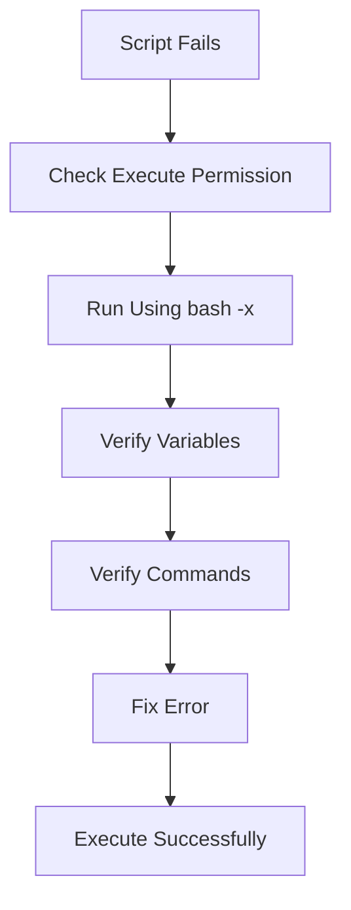
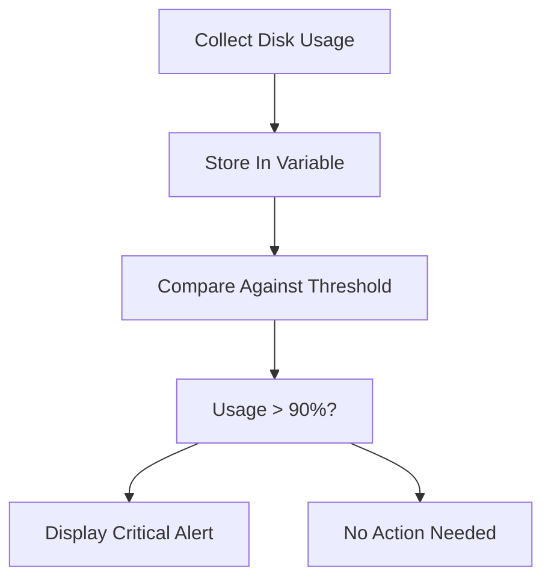

# Lab 03: Linux Bash Scripting

## Objective

Learn how to create Bash scripts that automate system administration tasks using variables, conditional statements, and command-line utilities.

By the end of this lab, you will be able to:

- Understand what Bash scripting is
- Create reusable automation scripts
- Use variables
- Use command substitution
- Implement if/then logic
- Debug scripts
- Build real-world system monitoring scripts

---

# What is Bash?

Bash stands for:

```text
Bourne Again Shell
```

It is the most commonly used Linux shell.

A shell acts as an interface between:

```text
User
 ↓
Shell
 ↓
Linux Kernel
 ↓
Hardware
```

Examples:

```bash
ls
pwd
df -h
```

These commands are executed through Bash.

---

# What is a Bash Script?

A Bash script is simply:

```text
A file containing Linux commands
```

that can be executed automatically.

Instead of manually running:

```bash
command1
command2
command3
```

you can place them inside a script:

```bash
script.sh
```

and execute everything together.

---

# Why Do We Need Bash Scripts?

In production environments administrators perform repetitive tasks like:

- Monitoring disk space
- Monitoring CPU usage
- Checking memory usage
- Creating backups
- Rotating logs
- Restarting failed services
- Generating reports

Doing these manually is inefficient.

---

# Real World Example

Without scripting:

```text
Login
 ↓
Check Disk
 ↓
Check Memory
 ↓
Check Services
 ↓
Generate Report
```

Every day.

---

With scripting:

```text
Run Script
 ↓
Everything Automated
```

---

# Understanding the Script

```bash
#!/bin/bash

THRESHOLD=90

USAGE=$(df / | grep / | awk '{ print $5 }' | sed 's/%//g')

if [ $USAGE -gt $THRESHOLD ]; then
    echo "Disk space is critical!"
fi
```

Let's break it apart.

---

# Shebang

```bash
#!/bin/bash
```

Called:

```text
Shebang
```

Tells Linux:

```text
Use Bash Interpreter
```

to execute this file.

---

# Variables

Variables store data.

Example:

```bash
NAME=Asritha
```

Use variable:

```bash
echo $NAME
```

Output:

```text
Asritha
```

---

# IMPORTANT

Correct:

```bash
NAME=value
```

Incorrect:

```bash
NAME = value
```

Spaces are not allowed.

---

# Threshold Variable

```bash
THRESHOLD=90
```

Stored value:

```text
90
```

Purpose:

```text
Alert when disk usage exceeds 90%
```

---

# Command Substitution

```bash
USAGE=$(command)
```

Command output is stored in a variable.

Example:

```bash
DATE=$(date)
```

Output:

```text
Current date stored in variable
```

---

# Understanding df

```bash
df /
```

Shows filesystem usage.

Example:

```text
Filesystem     Size Used Avail Use%
/dev/sda1      100G 80G 20G 80%
```

---

# Understanding grep

```bash
grep /
```

Filters lines containing:

```text
/
```

Output:

```text
/dev/sda1      100G 80G 20G 80%
```

---

# Understanding awk

Command:

```bash
awk '{ print $5 }'
```

Prints:

```text
Fifth Column
```

Output:

```text
80%
```

---

# Understanding sed

Input:

```text
80%
```

Command:

```bash
sed 's/%//g'
```

Output:

```text
80
```

Now the value becomes numeric.

---

# Final Variable Result

```bash
USAGE=80
```

or

```bash
USAGE=95
```

depending on the system.

---

# Understanding if Statements

If statements allow decision making.

Syntax:

```bash
if [ condition ]; then
   command
fi
```

---

# Example

```bash
NUMBER=10

if [ $NUMBER -gt 5 ]; then
    echo "Greater"
fi
```

Output:

```text
Greater
```

---

# Understanding -gt

Numeric comparison operators.

### Greater Than

```bash
-gt
```

Example:

```bash
10 -gt 5
```

True.

---

### Less Than

```bash
-lt
```

Example:

```bash
4 -lt 10
```

True.

---

### Equal

```bash
-eq
```

Example:

```bash
10 -eq 10
```

True.

---

# Script Logic

```bash
if [ $USAGE -gt $THRESHOLD ]
```

Meaning:

```text
If Disk Usage > 90%
```

then:

```bash
echo "Disk space is critical!"
```

---

# Example Execution

Current Disk Usage:

```text
95%
```

Threshold:

```text
90%
```

Evaluation:

```text
95 > 90
```

Result:

```text
Disk space is critical!
```

---

# Example Output

Disk Usage:

```text
70%
```

Threshold:

```text
90%
```

Condition:

```text
70 > 90
```

False.

Output:

```text
No output
```

---

# Creating the Script

Create file:

```bash
vi disk_monitor.sh
```

Paste script.

Save.

---

# Give Execute Permission

```bash
chmod +x disk_monitor.sh
```

Verify:

```bash
ls -l disk_monitor.sh
```

Expected:

```text
-rwxr-xr-x
```

---

# Execute Script

```bash
./disk_monitor.sh
```

---

# Debugging Bash Scripts

One of the most useful Linux admin skills.

Run:

```bash
bash -x disk_monitor.sh
```

Output:

```text
+ THRESHOLD=90
+ USAGE=83
+ '[' 83 -gt 90 ']'
```

Shows:

```text
Every Line Executed
```

Useful for troubleshooting.

---

# Real Production Example 1

Monitor disk usage.

If usage exceeds:

```text
90%
```

send email alert.

```text
Disk Full
 ↓
Alert Triggered
 ↓
Admin Notified
```

---

# Real Production Example 2

Monitor application process.

```bash
systemctl is-active nginx
```

If failed:

```bash
systemctl restart nginx
```

Automatic recovery.

---

# Real Production Example 3

Database backup.

```bash
mysqldump
```

Create backup.

```bash
tar
```

Compress.

```bash
scp
```

Copy to backup server.

All automated using Bash.

---

# Common Mistakes

## Missing Shebang

Bad:

```bash
echo Hello
```

Good:

```bash
#!/bin/bash
echo Hello
```

---

## Spaces Around =

Wrong:

```bash
NAME = John
```

Correct:

```bash
NAME=John
```

---

## Missing Execute Permission

Error:

```text
Permission denied
```

Fix:

```bash
chmod +x script.sh
```

---

## Missing fi

Wrong:

```bash
if [ $A -gt 10 ]; then
    echo Hi
```

Missing:

```bash
fi
```

---

# Troubleshooting Flow



---

# Workflow Diagram



---

# Command Summary

Create script:

```bash
vi disk_monitor.sh
```

Make executable:

```bash
chmod +x disk_monitor.sh
```

Execute:

```bash
./disk_monitor.sh
```

Run in debug mode:

```bash
bash -x disk_monitor.sh
```

Check disk usage:

```bash
df -h
```

---

# Key Learnings

- Bash is the most common Linux shell.
- Bash scripts automate repetitive administrative tasks.
- Variables store dynamic values.
- Command substitution captures command output.
- if/then constructs enable decision making.
- Bash scripts are heavily used in DevOps automation.
- `bash -x` is an excellent debugging tool.
- Linux administrators frequently use scripts for monitoring, backups, and system maintenance.

---

# Interview Questions

## What is Bash?

Bash (Bourne Again Shell) is a command-line interpreter used to interact with Linux systems.

---

## What is a Bash Script?

A text file containing commands executed by the Bash interpreter.

---

## What is a Shebang?

The first line of a script that specifies the interpreter.

Example:

```bash
#!/bin/bash
```

---

## How do you declare a variable in Bash?

```bash
NAME=Asritha
```

---

## What is command substitution?

Capturing command output inside a variable.

Example:

```bash
DATE=$(date)
```

---

## What is the purpose of `bash -x`?

It runs a script in debug mode and displays each command as it executes.

---

## Which operator is used for "greater than" in Bash?

```bash
-gt
```

---

## How would you troubleshoot a Bash script that isn't working?

1. Verify syntax.
2. Check execute permissions.
3. Run with `bash -x`.
4. Verify variables.
5. Verify command outputs.
6. Review logs and error messages.

---

## Why are Bash scripts important in DevOps?

They automate operational tasks such as monitoring, deployments, backups, health checks, and server maintenance, reducing manual effort and human error.

---

# DevOps Connection

Linux Basics taught:

```text
Users
Permissions
SSH
Cron
SELinux
```

System Administration adds:

```text
Bash Scripting
 ↓
Automation
 ↓
Operational Efficiency
```

Automation is a core DevOps principle:

```text
Manual Task
      ↓
Bash Script
      ↓
Cron Job
      ↓
Ansible Playbook
      ↓
Full Infrastructure Automation
```
