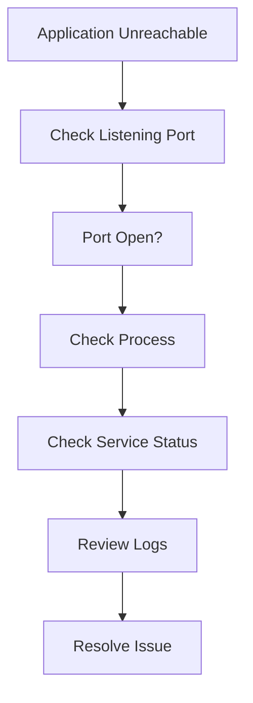
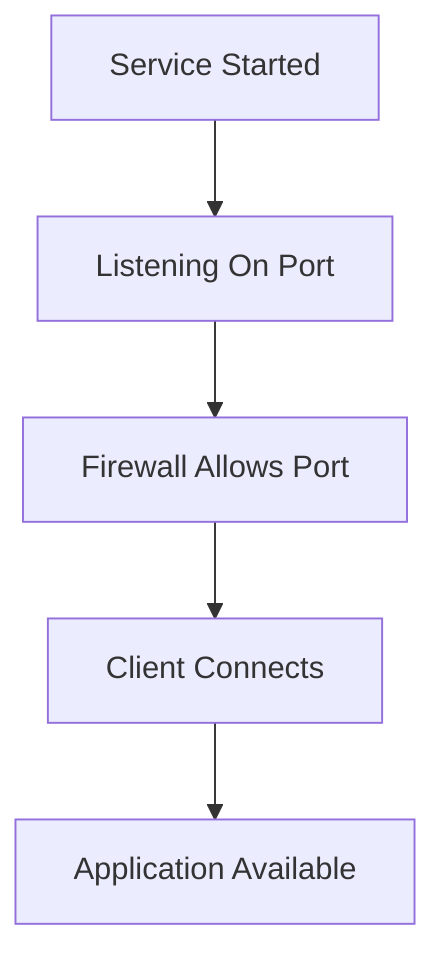

# Lab 05: Linux Network Services and Port Management

## Objective

Learn how to identify which services are listening on network ports and how to troubleshoot network-related application issues in Linux.

By the end of this lab, you will be able to:

- Understand ports and network services
- Use `ss` to inspect active connections
- Identify which process owns a port
- Verify application availability
- Troubleshoot port conflicts
- Diagnose service connectivity issues
- Understand common ports used in Linux environments

---

# Why Do We Need Network Service Monitoring?

Most applications communicate through network ports.

Examples:

```text
SSH      → Port 22
HTTP     → Port 80
HTTPS    → Port 443
MySQL    → Port 3306
Tomcat   → Port 8080
```

When users report:

```text
Website is inaccessible
```

or

```text
Database connection failed
```

One of the first things a Linux administrator checks is:

```text
Is the service listening on the expected port?
```

---

# Understanding Ports

Think of a server as an apartment building.

```text
Server
  ↓
Multiple Applications
  ↓
Each Application Gets A Port
```

Example:

```text
Port 22     SSH
Port 80     Nginx
Port 3306   MariaDB
Port 8080   Tomcat
```

Applications communicate using these ports.

---

# What Is a Listening Port?

When a service starts:

```text
Application
     ↓
Opens Port
     ↓
Waits For Requests
```

Example:

```text
Nginx
  ↓
Listens On Port 80
```

Users can then connect:

```text
http://server-ip
```

---

# What Happens If a Port Is Not Listening?

Example:

```text
Browser
   ↓
Port 80
   ↓
Connection Refused
```

Possible causes:

- Service not running
- Application crashed
- Firewall blocked access
- Wrong port configured

---

# Understanding TCP and UDP

Linux supports two major protocols.

---

## TCP

Transmission Control Protocol

Characteristics:

```text
Reliable
Connection-Oriented
Acknowledged Traffic
```

Examples:

```text
SSH
HTTP
HTTPS
MySQL
Tomcat
```

---

## UDP

User Datagram Protocol

Characteristics:

```text
Faster
Connectionless
No Delivery Guarantee
```

Examples:

```text
DNS
NTP
VoIP
Streaming Services
```

---

# Introduction to ss

`ss` stands for:

```text
Socket Statistics
```

It is the modern replacement for:

```text
netstat
```

Used for inspecting:

- Open ports
- Active connections
- Listening services
- Network sockets

---

# View All Listening Services

Run:

```bash
sudo ss -tulpn
```

Example Output:

```text
Netid State  Local Address:Port
tcp   LISTEN 0.0.0.0:22
tcp   LISTEN 0.0.0.0:80
tcp   LISTEN 0.0.0.0:3306
```

---

# Understanding the Options

Command:

```bash
sudo ss -tulpn
```

### -t

Show:

```text
TCP connections
```

---

### -u

Show:

```text
UDP connections
```

---

### -l

Show:

```text
Listening sockets only
```

---

### -p

Display:

```text
Process information
```

Example:

```text
nginx
sshd
mysqld
```

---

### -n

Display:

```text
Numeric ports
```

instead of service names.

Example:

```text
80
3306
8080
```

---

# Sample Output Analysis

Example:

```text
tcp LISTEN 0 128 0.0.0.0:22
users:(("sshd",pid=982,fd=3))
```

Interpretation:

```text
Protocol : TCP
Port     : 22
Service  : SSHD
PID      : 982
```

---

# Finding a Specific Port

Example:

Check HTTP service:

```bash
ss -tulpn | grep :80
```

Expected:

```text
nginx
```

or

```text
apache2
```

---

# Verify Tomcat

Check:

```bash
ss -tulpn | grep :8080
```

Expected:

```text
java
```

or

```text
tomcat
```

---

# Verify MariaDB

Check:

```bash
ss -tulpn | grep :3306
```

Expected:

```text
mysqld
```

or

```text
mariadbd
```

---

# Verify SSH

Check:

```bash
ss -tulpn | grep :22
```

Expected:

```text
sshd
```

---

# Common Ports Every DevOps Engineer Should Know

| Service | Port |
|----------|------|
| SSH | 22 |
| HTTP | 80 |
| HTTPS | 443 |
| DNS | 53 |
| SMTP | 25 |
| FTP | 21 |
| MySQL/MariaDB | 3306 |
| PostgreSQL | 5432 |
| Jenkins | 8080 |
| Tomcat | 8080 |
| Kubernetes API | 6443 |

---

# Real-World Scenario 1

## Website Not Accessible

User reports:

```text
Website Down
```

Check:

```bash
ss -tulpn | grep :80
```

No output.

Meaning:

```text
Nothing Listening On Port 80
```

---

### Verify Service

```bash
systemctl status nginx
```

Possible output:

```text
failed
```

Root cause found.

---

# Real-World Scenario 2

## Tomcat Not Opening

Check:

```bash
ss -tulpn | grep :8080
```

No output.

Verify:

```bash
ps -ef | grep tomcat
```

Tomcat not running.

---

### Fix

```bash
./bin/startup.sh
```

Verify port:

```bash
ss -tulpn | grep :8080
```

---

# Real-World Scenario 3

## Port Already In Use

Error:

```text
Address already in use
```

Check:

```bash
ss -tulpn | grep :8080
```

Output:

```text
java pid=1234
```

Another application is already using the port.

---

### Solution

Option 1:

Stop existing process.

```bash
kill 1234
```

---

Option 2:

Change application port.

Example:

```xml
<Connector port="9090"/>
```

---

# Real-World Scenario 4

## Database Connection Refused

Application log:

```text
Cannot connect to database
```

Check:

```bash
ss -tulpn | grep :3306
```

No output.

---

### Verify Service

```bash
systemctl status mariadb
```

Output:

```text
failed
```

Database service is down.

---

# Using netstat

Older systems may use:

```bash
netstat -tulpn
```

Same purpose.

Modern Linux prefers:

```bash
ss
```

because it is:

```text
Faster
More Efficient
Actively Maintained
```

---

# Troubleshooting Workflow



---

# Service Verification Workflow



---

# Command Summary

Show listening services:

```bash
sudo ss -tulpn
```

Check HTTP:

```bash
ss -tulpn | grep :80
```

Check HTTPS:

```bash
ss -tulpn | grep :443
```

Check SSH:

```bash
ss -tulpn | grep :22
```

Check MariaDB:

```bash
ss -tulpn | grep :3306
```

Check Tomcat:

```bash
ss -tulpn | grep :8080
```

Check specific PID:

```bash
ps -fp <PID>
```

---

# Key Learnings

- Applications communicate through network ports.
- Services must listen on ports to receive requests.
- `ss` is the preferred Linux utility for viewing network sockets.
- `ss -tulpn` displays listening TCP/UDP services.
- The `-p` option identifies the owning process.
- Port verification is one of the first troubleshooting steps.
- Common application failures are often caused by services not listening on expected ports.
- DevOps engineers frequently use `ss` when troubleshooting application, database, and web server issues.

---

# Interview Questions

## What does the `ss` command do?

It displays socket and network connection information, including listening ports and associated processes.

---

## What does `ss -tulpn` mean?

```text
-t  TCP
-u  UDP
-l  Listening sockets
-p  Process information
-n  Numeric ports
```

---


