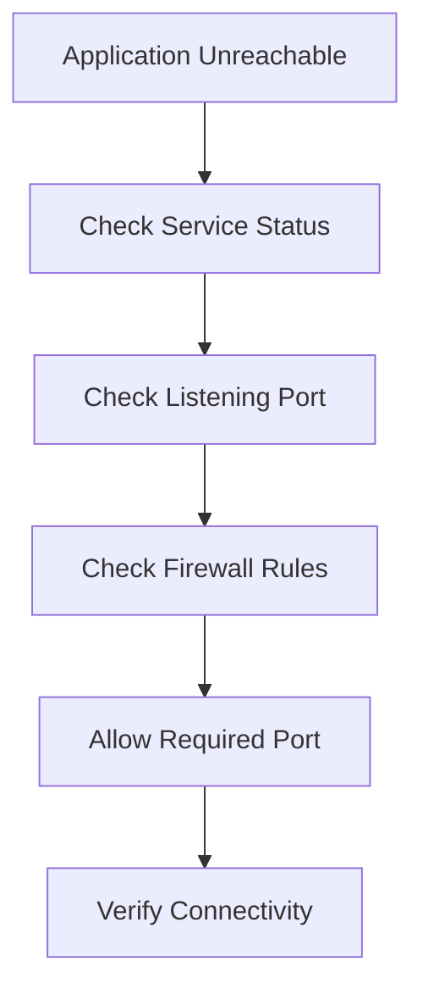
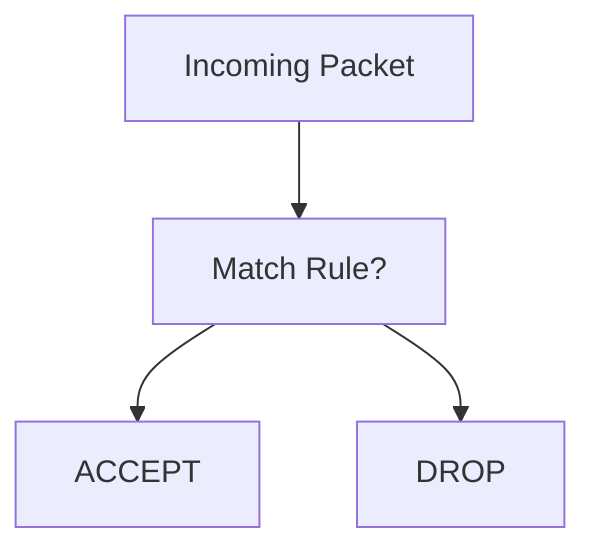

# Lab 06: IPTables Installation and Configuration

## Objective

Learn how to secure Linux servers using IPTables by controlling which network traffic is allowed or denied.

By the end of this lab, you will be able to:

- Understand Linux firewalls
- Understand packet filtering
- Configure IPTables rules
- Allow specific services and ports
- Block unwanted traffic
- View and verify firewall rules
- Save firewall configurations
- Troubleshoot connectivity issues caused by firewall rules

---

# What is IPTables?

IPTables is a Linux firewall utility used to filter network traffic.

It is responsible for controlling:

- Incoming traffic
- Outgoing traffic
- Forwarded traffic

Think of IPTables as a security guard standing at the entrance of your server.

```text
Internet
    ↓
IPTables Firewall
    ↓
Linux Server
```

Every network packet is inspected before it reaches the server.

---

# Why Do We Need IPTables?

A newly installed Linux server may expose multiple services.

Example:

```text
SSH     Port 22
HTTP    Port 80
HTTPS   Port 443
MySQL   Port 3306
Tomcat  Port 8080
```

Without a firewall:

```text
Everyone Can Reach Everything
```

With IPTables:

```text
Allow Required Traffic
      ↓
Block Everything Else
```

This significantly improves security.

---

# Understanding Network Traffic

Every request arrives as a packet.

Example:

```text
Client
   ↓
TCP Packet
   ↓
Linux Server
```

The firewall inspects the packet and decides:

```text
Allow ?
or
Block ?
```

---

# Understanding Firewall Policies

A firewall generally follows:

```text
Allow
or
Deny
```

Example:

```text
Allow Port 80
Allow Port 443
Block Everything Else
```

This is known as:

```text
Default Deny Strategy
```

and is considered a security best practice.

---

# IPTables Architecture

IPTables is organized into:

```text
Tables
Chains
Rules
```

---

# What is a Chain?

A chain is a sequence of rules.

Common chains:

```text
INPUT
OUTPUT
FORWARD
```

---

## INPUT Chain

Controls:

```text
Incoming Traffic
```

Example:

```text
User
 ↓
Server
```

Traffic passes through INPUT.

---

## OUTPUT Chain

Controls:

```text
Outgoing Traffic
```

Example:

```text
Server
 ↓
Internet
```

---

## FORWARD Chain

Controls:

```text
Traffic Passing Through Server
```

Typically used on routers and gateways.

---

# Understanding IPTables Rule Processing

Rules are evaluated:

```text
Top To Bottom
```

Example:

```text
Rule 1
Rule 2
Rule 3
```

The first matching rule wins.

---

# Why Rule Order Matters

Consider:

```text
Rule 1: DROP All
Rule 2: Allow SSH
```

Result:

```text
SSH Blocked
```

because traffic never reaches Rule 2.

---

Correct order:

```text
Rule 1: Allow SSH
Rule 2: DROP All
```

---

# Allow HTTP Traffic

To allow web traffic:

```bash
sudo iptables -A INPUT -p tcp --dport 80 -j ACCEPT
```

---

# Understanding the Command

```bash
sudo iptables -A INPUT -p tcp --dport 80 -j ACCEPT
```

### -A

```text
Append Rule
```

---

### INPUT

Apply rule to INPUT chain.

---

### -p tcp

Protocol:

```text
TCP
```

---

### --dport 80

Destination port:

```text
80
```

---

### -j ACCEPT

Action:

```text
Allow Traffic
```

---

# View Current Rules

Display rules:

```bash
sudo iptables -L -n
```

Example:

```text
Chain INPUT
ACCEPT tcp -- anywhere anywhere tcp dpt:80
```

---

# Understanding the Output

Example:

```text
ACCEPT tcp -- 0.0.0.0/0 0.0.0.0/0 tcp dpt:80
```

Meaning:

```text
Allow TCP traffic
On Port 80
From Any Source
```

---

# Allow SSH Access

Always allow SSH before enabling restrictive policies.

```bash
sudo iptables -A INPUT -p tcp --dport 22 -j ACCEPT
```

Without this rule:

```text
You May Lock Yourself Out
```

---

# Allow HTTPS

```bash
sudo iptables -A INPUT -p tcp --dport 443 -j ACCEPT
```

---

# Allow Tomcat

```bash
sudo iptables -A INPUT -p tcp --dport 8080 -j ACCEPT
```

---

# Allow MariaDB (Internal Networks Only)

Example:

```bash
sudo iptables -A INPUT -p tcp --dport 3306 -j ACCEPT
```

In production, database ports should normally be restricted to trusted hosts.

---

# Setting Default Policy

A secure firewall often ends with:

```bash
sudo iptables -P INPUT DROP
```

Meaning:

```text
Block Everything
Unless Explicitly Allowed
```

---

# Typical Secure Configuration

```text
Allow SSH
Allow HTTP
Allow HTTPS
Drop Everything Else
```

---

# Example Workflow

```text
Internet Request
       ↓
Port 80
       ↓
Firewall Rule Exists
       ↓
ACCEPT
       ↓
Web Server
```

---

# What Happens With Unauthorized Ports?

Example:

```text
Port 9000
```

not allowed.

```text
Incoming Packet
       ↓
No Matching Rule
       ↓
DROP
```

Connection denied.

---

# Verify a Service Is Listening

Firewall troubleshooting often starts with:

```bash
ss -tulpn
```

Example:

```bash
ss -tulpn | grep :80
```

Output:

```text
nginx
```

---

# Difference Between Service Problem and Firewall Problem

Application Failure:

```text
Nothing Listening
```

Check:

```bash
systemctl status nginx
```

---

Firewall Problem:

```text
Application Running
But Traffic Blocked
```

Check:

```bash
iptables -L -n
```

---

# Viewing Rules With Numbers

Useful for troubleshooting:

```bash
sudo iptables -L --line-numbers
```

Output:

```text
1 ACCEPT tcp dpt:22
2 ACCEPT tcp dpt:80
3 DROP all
```

---

# Removing a Rule

Delete by number:

```bash
sudo iptables -D INPUT 2
```

Deletes rule number 2.

---

# Saving Rules

IPTables rules may disappear after reboot.

Save them:

```bash
sudo iptables-save > /etc/iptables.rules
```

---

# Restore Rules

```bash
sudo iptables-restore < /etc/iptables.rules
```

---

# Real Production Scenario 1

## Website Down

Users report:

```text
Cannot Access Website
```

---

### Check Service

```bash
systemctl status nginx
```

Output:

```text
active (running)
```

---

### Check Port

```bash
ss -tulpn | grep :80
```

Output:

```text
nginx is listening
```

---

### Check Firewall

```bash
iptables -L -n
```

Observe:

```text
No Port 80 Rule
```

---

### Fix

```bash
iptables -A INPUT -p tcp --dport 80 -j ACCEPT
```

---

# Real Production Scenario 2

## Locked Out After Firewall Change

Admin accidentally:

```bash
iptables -P INPUT DROP
```

before allowing SSH.

Result:

```text
SSH Access Lost
```

Root Cause:

```text
Port 22 Not Allowed
```

Lesson:

Always allow SSH first.

---

# Real Production Scenario 3

## Tomcat Not Reachable

Check:

```bash
ss -tulpn | grep :8080
```

Tomcat running.

---

Browser:

```text
Cannot connect
```

Check:

```bash
iptables -L -n
```

Missing:

```text
Port 8080 Rule
```

---

### Fix

```bash
iptables -A INPUT -p tcp --dport 8080 -j ACCEPT
```

---

# Troubleshooting Flow



---

# Firewall Decision Flow



---

# Command Summary

Allow SSH:

```bash
sudo iptables -A INPUT -p tcp --dport 22 -j ACCEPT
```

Allow HTTP:

```bash
sudo iptables -A INPUT -p tcp --dport 80 -j ACCEPT
```

Allow HTTPS:

```bash
sudo iptables -A INPUT -p tcp --dport 443 -j ACCEPT
```

Allow Tomcat:

```bash
sudo iptables -A INPUT -p tcp --dport 8080 -j ACCEPT
```

View rules:

```bash
sudo iptables -L -n
```

View numbered rules:

```bash
sudo iptables -L --line-numbers
```

Set default DROP policy:

```bash
sudo iptables -P INPUT DROP
```

Save rules:

```bash
sudo iptables-save > /etc/iptables.rules
```

---

# Key Learnings

- IPTables is a Linux packet-filtering firewall.
- Firewalls control incoming and outgoing traffic.
- Rules are evaluated from top to bottom.
- Rule order is extremely important.
- The INPUT chain controls inbound traffic.
- Port access must be explicitly allowed.
- Always allow SSH before applying restrictive rules.
- Verify services are listening before troubleshooting firewall issues.
- Save firewall rules to survive reboots.

---

# Interview Questions

## What is IPTables?

IPTables is a Linux firewall framework used to inspect, permit, or deny network packets.

---

## What does the INPUT chain control?

Incoming traffic to the server.

---

## What does this command do?

```bash
iptables -A INPUT -p tcp --dport 80 -j ACCEPT
```

Allows incoming TCP traffic on port 80.

---

## Why is rule order important?

IPTables processes rules sequentially, and the first matching rule is applied.

---

## How do you view firewall rules?

```bash
iptables -L -n
```

---

## How do you identify which service is listening on a port?

```bash
ss -tulpn
```

---

## What is the risk of applying `INPUT DROP` before allowing SSH?

You may lock yourself out of the server remotely.

---

## A web server is running, but users cannot access it. What would you check?

1. Service status
2. Listening port
3. Firewall rules
4. Routing/firewall devices
5. Application logs

---

# DevOps Connection

System Administration 
