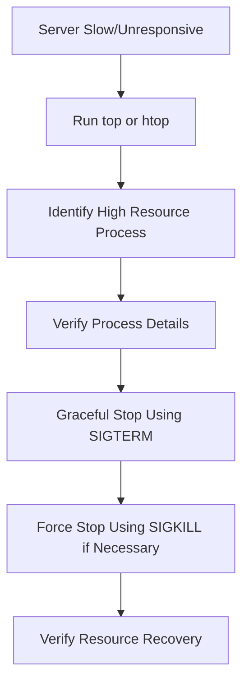
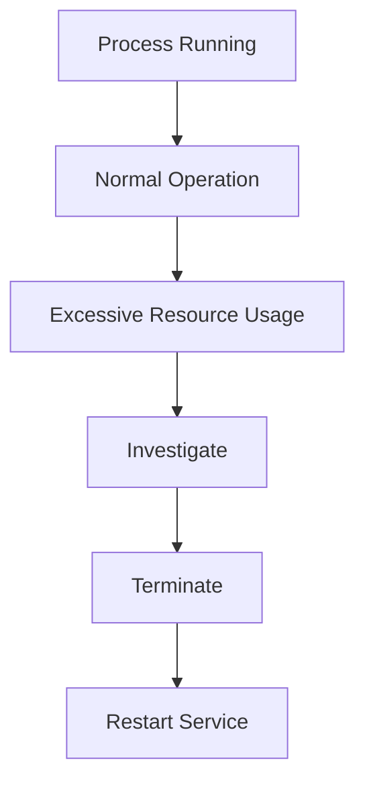

# Lab 07: Linux Process Troubleshooting

## Objective

Learn how to identify, investigate, and terminate problematic processes that consume excessive CPU, memory, or system resources.

By the end of this lab, you will be able to:

- Understand Linux processes
- Identify high CPU and memory consumers
- Use `top` and `htop`
- Find Process IDs (PIDs)
- Gracefully stop processes
- Forcefully terminate hung processes
- Troubleshoot server performance issues
- Apply real-world incident response techniques

---

# Why Do We Need Process Troubleshooting?

In production environments, servers can become:

```text
Slow
Unresponsive
Laggy
Out Of Memory
High CPU Usage
```

Common causes:

- Infinite loops
- Memory leaks
- Runaway scripts
- Hung applications
- Database issues
- Java applications consuming resources

A Linux administrator must quickly identify:

```text
Which process is causing the issue?
```

---

# What Is a Process?

A process is:

```text
A Running Program
```

Examples:

```text
nginx
sshd
mariadb
tomcat
chrome
python
java
```

When a program starts:

```text
Program
   ↓
Process Created
   ↓
PID Assigned
```

---

# What Is a PID?

PID stands for:

```text
Process ID
```

Every running process has a unique identifier.

Example:

```text
PID 1001
PID 1002
PID 1003
```

Check processes:

```bash
ps -ef
```

Example:

```text
root   1234 nginx
mysql  1456 mariadb
tomcat 1678 java
```

---

# Process Lifecycle

```text
Start Process
      ↓
Running
      ↓
Consumes Resources
      ↓
Completes Or Terminates
```

Sometimes processes become:

```text
Hung
Stuck
Zombie
Unresponsive
```

requiring intervention.

---

# Understanding System Resources

Processes consume:

### CPU

```text
Processing Power
```

---

### Memory

```text
RAM
```

---

### Disk I/O

```text
Read/Write Operations
```

---

### Network

```text
Incoming/Outgoing Traffic
```

When one process consumes too much:

```text
Server Performance Drops
```

---

# Using top

The most common Linux monitoring tool.

Run:

```bash
top
```

Example:

```text
PID USER   %CPU %MEM COMMAND
1234 root   90.5 10.2 java
2234 mysql  12.5 15.6 mariadbd
```

---

# Understanding top Output

Example:

```text
PID
```

Process ID.

---

```text
USER
```

Owner of the process.

---

```text
%CPU
```

CPU utilization.

---

```text
%MEM
```

Memory utilization.

---

```text
COMMAND
```

Program name.

---

# Using htop

Enhanced version of top.

Install:

```bash
sudo apt install htop -y
```

or

```bash
sudo yum install htop -y
```

Run:

```bash
htop
```

Benefits:

- Colorized output
- Easier navigation
- Interactive process management

---

# Finding High CPU Consumers

Using top:

```bash
top
```

Example:

```text
PID    COMMAND   CPU%
5678   java      95%
```

This indicates:

```text
Java Process Consuming Most CPU
```

---

# Finding High Memory Consumers

Using:

```bash
top
```

or

```bash
ps aux --sort=-%mem
```

Example:

```text
java
```

using:

```text
6 GB RAM
```

---

# Alternative Commands

Sort by CPU:

```bash
ps aux --sort=-%cpu
```

---

Sort by Memory:

```bash
ps aux --sort=-%mem
```

---

View Specific Process:

```bash
ps -fp <PID>
```

Example:

```bash
ps -fp 1234
```

---

# Gracefully Stopping a Process

Preferred method:

```bash
kill -15 <PID>
```

Example:

```bash
kill -15 1234
```

---

# What is SIGTERM?

Signal:

```text
SIGTERM
```

Value:

```text
15
```

Meaning:

```text
Please Stop
```

The application gets an opportunity to:

- Save data
- Close files
- Release resources
- Shutdown cleanly

---

# Example

```bash
kill -15 1234
```

Application receives:

```text
Termination Request
```

and exits gracefully.

---

# Why Use SIGTERM First?

Because:

```text
Safe
Controlled
Graceful
```

It minimizes:

```text
Data Loss
Corruption
```

---

# Force Stopping a Process

If SIGTERM fails:

```bash
kill -9 <PID>
```

Example:

```bash
kill -9 1234
```

---

# What is SIGKILL?

Signal:

```text
SIGKILL
```

Value:

```text
9
```

Meaning:

```text
Immediate Termination
```

The process cannot:

- Ignore
- Handle
- Delay

the signal.

---

# Why Use SIGKILL Carefully?

Potential issues:

```text
Data Corruption
Incomplete Writes
Lost Transactions
```

Always try:

```bash
kill -15
```

first.

---

# Checking If Process Stopped

Run:

```bash
ps -ef | grep 1234
```

If no output:

```text
Process Successfully Terminated
```

---

# Real Production Scenario 1

## Server Running Slowly

Users complain:

```text
Application Slow
```

---

### Check Processes

```bash
top
```

Output:

```text
java 95% CPU
```

---

### Identify PID

```text
PID 4567
```

---

### Verify

```bash
ps -fp 4567
```

---

### Restart Application

```bash
kill -15 4567
```

Restart service.

Problem resolved.

---

# Real Production Scenario 2

## Memory Exhausted

Server alert:

```text
95% Memory Used
```

---

### Find Consumer

```bash
ps aux --sort=-%mem
```

Output:

```text
java
```

using:

```text
7GB RAM
```

---

### Investigate Logs

Check:

```bash
journalctl -u tomcat
```

Possible root cause:

```text
Memory Leak
```

---

### Temporary Fix

```bash
kill -15 <PID>
```

Restart service.

---

# Real Production Scenario 3

## Hung Backup Script

Users report:

```text
Nightly Backup Never Finishes
```

Check:

```bash
top
```

Output:

```text
backup.sh
```

running for hours.

---

Terminate:

```bash
kill -15 PID
```

If ignored:

```bash
kill -9 PID
```

---

# Real Production Scenario 4

## Zombie Processes

Check:

```bash
ps -ef | grep defunct
```

Example:

```text
<defunct>
```

Zombie processes have:

```text
PID
No Running State
No Resource Usage
```

Often require restarting the parent process.

---

# Ownership Rules

Normal users can terminate:

```text
Their Own Processes
```

Example:

```bash
kill 1234
```

if owned by user.

---

For system processes:

```bash
sudo kill 1234
```

required.

---

# Viewing Process Tree

Useful for troubleshooting parent-child relationships.

```bash
pstree
```

Example:

```text
systemd
 ├─sshd
 ├─nginx
 └─java
```

---

# Troubleshooting Workflow



---

# Process Management Workflow



---

# Command Summary

View processes:

```bash
ps -ef
```

Real-time monitor:

```bash
top
```

Interactive monitor:

