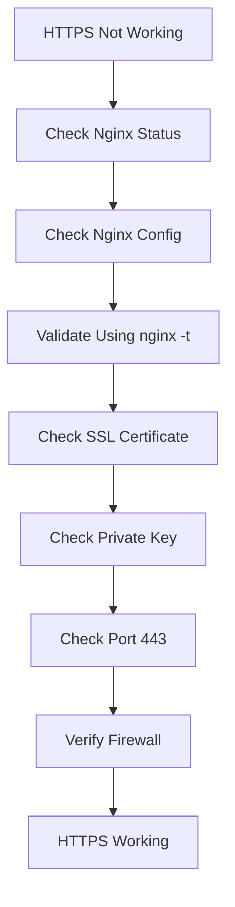
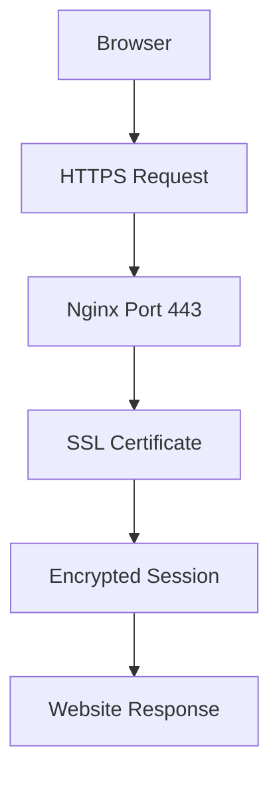

# Lab 01: Setup SSL for Nginx

## Objective

Learn how to configure SSL/TLS encryption for an Nginx web server so that users can securely access websites using HTTPS.

By the end of this lab, you will be able to:

- Understand SSL/TLS concepts
- Configure HTTPS on Nginx
- Use SSL certificates and private keys
- Secure web traffic using encryption
- Verify SSL configuration
- Troubleshoot common SSL issues
- Follow HTTPS best practices

---

# What is SSL/TLS?

SSL (Secure Sockets Layer) and TLS (Transport Layer Security) are technologies used to encrypt communication between a client and a server.

Today, TLS is the modern standard, but the term SSL is still commonly used.

Without SSL:

```text
Browser
    ↓
Plain Text Data
    ↓
Web Server
```

Data can be intercepted.

With SSL:

```text
Browser
    ↓
Encrypted Data
    ↓
Web Server
```

Data is protected.

---

# Why Do We Need SSL?

SSL protects:

- Usernames
- Passwords
- Credit card information
- Personal information
- API communications
- Business data

Without SSL:

```text
http://example.com
```

Traffic is unencrypted.

With SSL:

```text
https://example.com
```

Traffic is encrypted.

---

# Real-World Importance

Modern applications require HTTPS:

Examples:

```text
Banking Applications
E-commerce Sites
Cloud Services
Corporate Portals
APIs
```

Browsers warn users when HTTP is used:

```text
Not Secure
```

---

# HTTP vs HTTPS

## HTTP

```text
Port: 80
Encrypted: No
Secure: No
```

Example:

```text
http://example.com
```

---

## HTTPS

```text
Port: 443
Encrypted: Yes
Secure: Yes
```

Example:

```text
https://example.com
```

---

# SSL Components

An SSL configuration typically consists of:

## Certificate

```text
server.crt
```

Contains:

- Public Key
- Server Information
- Certificate Authority Information

---

## Private Key

```text
server.key
```

Contains:

```text
Private Encryption Key
```

This file must remain secret.

---

# Security Rule

Never share:

```text
server.key
```

You can share:

```text
server.crt
```

but never expose the private key.

---

# Basic SSL Configuration

Edit Nginx configuration:

```nginx
server {
    listen 443 ssl;

    ssl_certificate /etc/ssl/certs/server.crt;

    ssl_certificate_key /etc/ssl/private/server.key;
}
```

---

# Understanding the Configuration

## listen 443 ssl

```nginx
listen 443 ssl;
```

Meaning:

```text
Listen on Port 443
Enable SSL/TLS
```

---

## ssl_certificate

```nginx
ssl_certificate /etc/ssl/certs/server.crt;
```

Specifies:

```text
Certificate File
```

used by clients to verify identity.

---

## ssl_certificate_key

```nginx
ssl_certificate_key /etc/ssl/private/server.key;
```

Specifies:

```text
Private Key File
```

used for encryption.

---

# Typical Linux Locations

Certificate:

```text
/etc/ssl/certs/
```

Private Key:

```text
/etc/ssl/private/
```

---

# Why Protect the Private Key?

The private key is the most sensitive SSL file.

If leaked:

```text
Attackers Could Impersonate Your Website
```

---

# Restrict Permissions

Set permissions:

```bash
chmod 600 /etc/ssl/private/server.key
```

Output:

```text
-rw-------
```

Meaning:

```text
Only Root Can Read/Write
```

---

# Verify Permissions

Check:

```bash
ls -l /etc/ssl/private/server.key
```

Expected:

```text
-rw-------
```

---

# Test Nginx Configuration

Before restarting Nginx:

```bash
nginx -t
```

Expected:

```text
syntax is ok
test is successful
```

---

# Why Test First?

Avoid downtime.

Bad configuration:

```text
Nginx Will Not Start
```

Always validate before restarting.

---

# Restart Nginx

After successful validation:

```bash
systemctl restart nginx
```

---

# Verify Nginx Status

```bash
systemctl status nginx
```

Expected:

```text
active (running)
```

---

# Verify HTTPS Port

Check:

```bash
ss -tulpn | grep :443
```

Expected:

```text
LISTEN
```

Meaning:

```text
Nginx Listening on HTTPS Port
```

---

# Verify Website

Open:

```text
https://your-server-ip
```

Expected:

```text
Secure Site
Padlock Icon
```

Browser indicates encrypted traffic.

---

# SSL Communication Workflow

```text
Browser
     ↓
HTTPS Request
     ↓
Nginx
     ↓
Certificate Presented
     ↓
Encrypted Session Established
     ↓
Secure Communication
```

---

# HTTP to HTTPS Redirect

Production environments typically redirect all HTTP traffic to HTTPS.

Example:

```nginx
server {
    listen 80;
    server_name example.com;

    return 301 https://$host$request_uri;
}
```

---

# Benefits

Users accessing:

```text
http://example.com
```

are automatically redirected to:

```text
https://example.com
```

---

# Common SSL Troubleshooting

---

# Scenario 1: Nginx Fails to Start

Check:

```bash
nginx -t
```

Example:

```text
cannot load certificate
```

---

## Root Cause

Wrong certificate path.

---

## Fix

Verify:

```bash
ls -l /etc/ssl/certs/
```

Confirm file exists.

---

# Scenario 2: Permission Denied

Error:

```text
Permission denied
```

---

## Check Permissions

```bash
ls -l /etc/ssl/private/server.key
```

---

## Fix

```bash
chmod 600 server.key
```

---

# Scenario 3: HTTPS Not Accessible

Verify:

```bash
systemctl status nginx
```

---

Check:

```bash
ss -tulpn | grep :443
```

---

Verify firewall:

```bash
iptables -L -n
```

or

```bash
firewall-cmd --list-ports
```

---

# Scenario 4: Browser Shows Certificate Warning

Potential causes:

- Self-signed certificate
- Expired certificate
- Domain mismatch

Verify:

```bash
openssl x509 -in server.crt -text -noout
```

---

# Scenario 5: SSL Certificate Expired

Check:

```bash
openssl x509 -enddate -noout -in server.crt
```

Example:

```text
notAfter=Dec 20 12:00:00 2026 GMT
```

Renew certificate before expiration.

---

# SSL Troubleshooting Flow



---

# HTTPS Request Flow



---

# Command Summary

Check certificate:

```bash
ls -l /etc/ssl/certs/server.crt
```

Check private key:

```bash
ls -l /etc/ssl/private/server.key
```

Restrict key permissions:

```bash
chmod 600 /etc/ssl/private/server.key
```

Validate configuration:

```bash
nginx -t
```

Restart Nginx:

```bash
systemctl restart nginx
```

Check service:

```bash
systemctl status nginx
```

Verify HTTPS port:

```bash
ss -tulpn | grep :443
```

Check certificate expiry:

```bash
openssl x509 -enddate -noout -in server.crt
```

---

# Key Learnings

- HTTPS encrypts communication between clients and servers.
- SSL certificates identify the server.
- Private keys must be protected.
- Nginx uses port 443 for HTTPS.
- Always validate configurations using `nginx -t`.
- Restrict private key permissions with `chmod 600`.
- Verify HTTPS using port checks and browser testing.
- SSL is a fundamental web security requirement.

---

# Interview Questions

## What is the purpose of SSL/TLS?

SSL/TLS encrypts communication between clients and servers, protecting sensitive data from interception.

---

## What is the difference between HTTP and HTTPS?

HTTP is unencrypted and uses port 80.

HTTPS is encrypted and uses port 443.

---

## Which files are required for Nginx SSL configuration?

```text
Certificate File (.crt)
Private Key (.key)
```

---

## Why is the private key important?

It is used for encryption and must remain secret.

---

## Which permission should be assigned to a private key?

```bash
chmod 600 server.key
```

---

## Why should you run `nginx -t` before restarting?

To validate configuration syntax and avoid service outages.

---

## How do you check if Nginx is listening on HTTPS?

```bash
ss -tulpn | grep :443
```

---

## How do you check SSL certificate expiry?

```bash
openssl x509 -enddate -noout -in server.crt
```

---

## A website works on HTTP but not HTTPS. What would you troubleshoot?

1. Nginx service status.
2. SSL configuration.
3. Certificate path.
4. Private key path.
5. Port 443 listener.
6. Firewall rules.
7. Browser certificate errors.

---

# DevOps Connection

Web Servers & Databases Module Journey:

```text
SSL/TLS Security
      ↓
Nginx Web Server
      ↓
HTTPS Configuration
      ↓
Database Connectivity
      ↓
Reverse Proxies
      ↓
Production Web Hosting
```

SSL is one of the first security controls implemented when exposing an application to users. Nearly every production web application today requires HTTPS, making SSL configuration a foundational skill for Linux Administrators and DevOps Engineers.
