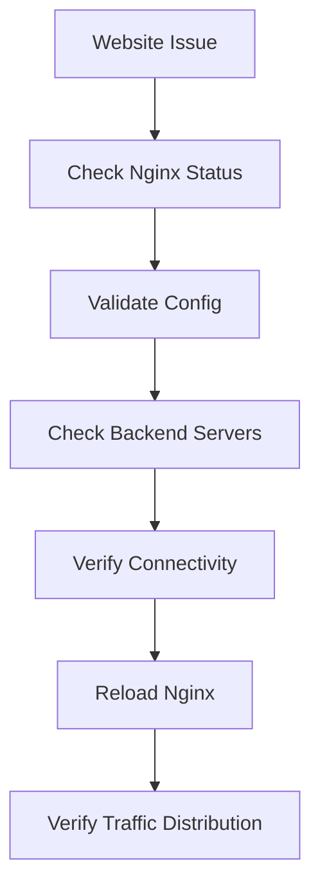
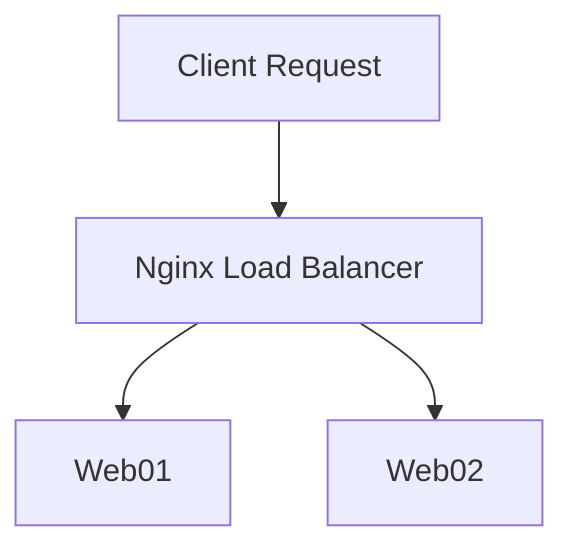

# Lab 02: Install and Configure Nginx as a Load Balancer (LBR)

## Objective

Learn how to configure Nginx as a Load Balancer to distribute traffic across multiple backend web servers.

By the end of this lab, you will be able to:

- Understand Load Balancing concepts
- Configure Nginx as a reverse proxy
- Configure backend server pools using `upstream`
- Distribute traffic across multiple servers
- Understand load-balancing algorithms
- Troubleshoot load-balancer issues
- Understand real-world High Availability (HA) architecture

---

# What is a Load Balancer?

A Load Balancer is a system that distributes incoming requests across multiple backend servers.

Without a load balancer:

```text
Users
   ↓
Web Server 1
```

All traffic hits one server.

If the server becomes overloaded:

```text
Slow Website
Application Crash
Downtime
```

---

# Why Do We Need a Load Balancer?

Imagine an e-commerce website:

```text
10 Users
```

One server may handle it.

But later:

```text
10,000 Users
```

One server becomes a bottleneck.

Instead:

```text
                 Load Balancer
                        ↓
        ┌──────────────┼──────────────┐
        │              │              │
        ▼              ▼              ▼
     Web01          Web02          Web03
```

Traffic is distributed across multiple servers.

---

# Benefits of Load Balancing

✅ Improved Performance

✅ High Availability

✅ Fault Tolerance

✅ Better Resource Utilization

✅ Horizontal Scaling

✅ Reduced Server Overload

---

# What is Nginx?

Nginx can act as:

```text
Web Server
Reverse Proxy
Load Balancer
SSL Terminator
```

In this lab:

```text
Nginx = Load Balancer
```

---

# Understanding Reverse Proxy

A reverse proxy sits between users and backend servers.

```text
Client
  ↓
Nginx Load Balancer
  ↓
Backend Servers
```

Users never directly communicate with backend servers.

---

# Architecture Overview

```text
      Internet
           │
           ▼
    Nginx Load Balancer
           │
    ┌──────┴──────┐
    │             │
    ▼             ▼
 Web-1         Web-2
10.0.0.1      10.0.0.2
```

---

# What is an Upstream Block?

The `upstream` block defines backend servers.

Example:

```nginx
upstream my_servers {

    server 10.0.0.1;

    server 10.0.0.2;

}
```

This creates a server pool.

---

# Understanding the Configuration

### Backend Server 1

```nginx
server 10.0.0.1;
```

Nginx can send requests here.

---

### Backend Server 2

```nginx
server 10.0.0.2;
```

Nginx can also send requests here.

---

# Configure Nginx Load Balancer

Example:

```nginx
upstream my_servers {

    server 10.0.0.1;
    server 10.0.0.2;

}

server {

    listen 80;

    location / {

        proxy_pass http://my_servers;

    }

}
```

---

# What Does proxy_pass Do?

```nginx
proxy_pass http://my_servers;
```

Tells Nginx:

```text
Forward Requests
To Backend Pool
```

instead of serving the request directly.

---

# Request Flow

```text
User Request
      ↓
Nginx Load Balancer
      ↓
Backend Pool
      ↓
Selected Server
      ↓
Response Returned
```

---

# Default Load Balancing Algorithm

Nginx uses:

```text
Round Robin
```

by default.

---

# Round Robin Example

Request 1:

```text
Web01
```

Request 2:

```text
Web02
```

Request 3:

```text
Web01
```

Request 4:

```text
Web02
```

Traffic rotates evenly.

---

# Weighted Load Balancing

Useful when servers have different capacities.

Example:

```nginx
upstream my_servers {

    server 10.0.0.1 weight=3;
    server 10.0.0.2 weight=1;

}
```

Meaning:

```text
Web01 receives ~75%
Web02 receives ~25%
```

---

# Least Connections Algorithm

Nginx sends traffic to the server with fewer active connections.

```nginx
upstream my_servers {

    least_conn;

    server 10.0.0.1;
    server 10.0.0.2;

}
```

Useful for:

```text
Long-running sessions
Streaming
WebSockets
```

---

# IP Hash Algorithm

Consistent routing based on client IP.

```nginx
upstream my_servers {

    ip_hash;

    server 10.0.0.1;
    server 10.0.0.2;

}
```

Benefits:

```text
Session Persistence
```

User returns to the same backend.

---

# Health Checks

If a backend server becomes unavailable:

```text
Web01 Down
```

Nginx automatically routes traffic to healthy servers.

Example:

```nginx
server 10.0.0.1 max_fails=3 fail_timeout=30s;
```

Meaning:

```text
After 3 failures
Mark server unavailable
For 30 seconds
```

---

# Verify Configuration

Before reloading Nginx:

```bash
nginx -t
```

Expected:

```text
syntax is ok
test is successful
```

---

# Reload Configuration

```bash
systemctl reload nginx
```

or

```bash
systemctl restart nginx
```

---

# Verify Nginx Service

```bash
systemctl status nginx
```

Expected:

```text
active (running)
```

---

# Verify Listening Port

```bash
ss -tulpn | grep :80
```

Expected:

```text
LISTEN
```

---

# Testing Load Balancing

Suppose:

```text
Web01 returns:
Server 1

Web02 returns:
Server 2
```

Refresh browser repeatedly.

Expected:

```text
Server 1
Server 2
Server 1
Server 2
```

Round Robin is working.

---

# Real-World Example

E-Commerce Architecture

```text
Users
   ↓
Nginx Load Balancer
   ↓
Web01
Web02
Web03
   ↓
MariaDB Cluster
```

Benefits:

```text
Scalability
Fault Tolerance
High Availability
```

---

# Production Scenario 1

## Issue

Website is slow.

### Investigation

Check backend server usage:

```bash
top
```

One server overloaded.

---

### Solution

Add another backend:

```nginx
upstream my_servers {

    server 10.0.0.1;
    server 10.0.0.2;
    server 10.0.0.3;

}
```

Reload Nginx.

---

# Production Scenario 2

## Issue

Backend Server Failed

```text
Web02 Crashed
```

---

### Verify

```bash
curl http://10.0.0.2
```

No response.

---

### Result

Nginx sends traffic only to:

```text
Web01
```

until Web02 recovers.

---

# Production Scenario 3

## Issue

Users Frequently Log Out

Problem:

```text
Requests routed to different servers
```

Session stored locally.

---

### Solution

Use:

```nginx
ip_hash;
```

or centralized session storage.

---

# Load Balancer Troubleshooting Flow



---

# Request Flow Diagram



---

# Command Summary

Validate Nginx configuration:

```bash
nginx -t
```

Restart Nginx:

```bash
systemctl restart nginx
```

Reload configuration:

```bash
systemctl reload nginx
```

Check status:

```bash
systemctl status nginx
```

Check port:

```bash
ss -tulpn | grep :80
```

Test backend:

```bash
curl http://backend-ip
```

---

# Key Learnings

- Load Balancers distribute client traffic across multiple servers.
- Nginx can act as a reverse proxy and load balancer.
- Backend servers are defined using the `upstream` block.
- `proxy_pass` forwards traffic to backend servers.
- Round Robin is the default load-balancing algorithm.
- Nginx improves performance, scalability, and availability.
- Health checks help prevent traffic from reaching failed servers.
- Always validate configurations using `nginx -t`.

---

# Interview Questions

## What is a Load Balancer?

A Load Balancer distributes incoming traffic across multiple backend servers to improve availability and performance.

---

## Why do we use Nginx as a Load Balancer?

Nginx provides:

- Reverse Proxy
- Load Balancing
- SSL Termination
- High Performance

---

## What is an upstream block?

An Nginx configuration block that defines a group of backend servers.

Example:

```nginx
upstream my_servers {
    server 10.0.0.1;
    server 10.0.0.2;
}
```

---

## What does proxy_pass do?

It forwards requests to a backend server or upstream group.

---

## What is the default Nginx load-balancing algorithm?

```text
Round Robin
```

---

## What is the purpose of ip_hash?

It provides session persistence by consistently routing a client to the same backend server.

---

## How do you verify Nginx configuration before restarting?

```bash
nginx -t
```

---

## A website behind Nginx is not loading. What would you check?

1. Nginx service status.
2. Nginx configuration.
3. Backend server availability.
4. Network connectivity.
5. Firewall rules.
6. Nginx logs.

---

# DevOps Connection

Web Servers & Databases Journey:

```text
SSL/TLS
     ↓
Nginx Web Server
     ↓
Load Balancing
     ↓
High Availability
     ↓
Database Connectivity
     ↓
Scalable Architectures
```

Load balancing is one of the core building blocks of modern cloud and DevOps architectures because it improves scalability, resiliency, and user experience by ensuring traffic is distributed efficiently across multiple servers.
