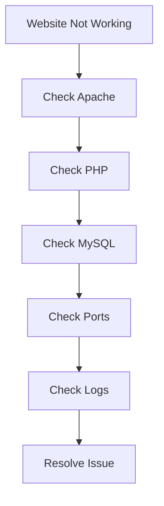
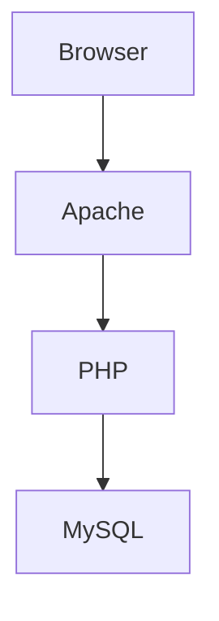

# Lab 04: Configure a LAMP Server

## Objective

Learn how to install and configure a LAMP stack, one of the most widely used web hosting platforms for dynamic web applications.

By the end of this lab, you will be able to:

- Understand LAMP architecture
- Install Apache Web Server
- Install MySQL Database Server
- Install PHP
- Connect Apache, PHP, and MySQL together
- Test PHP functionality
- Secure MySQL installation
- Troubleshoot common LAMP issues
- Deploy PHP-based applications such as WordPress

---

# What is LAMP?

LAMP stands for:

```text
L = Linux
A = Apache
M = MySQL
P = PHP
```

It is a complete web application stack used to host dynamic websites.

---

# Why Do We Need LAMP?

Modern websites require:

- A web server
- A database
- A programming language
- An operating system

Example:

```text
User
  ↓
Browser
  ↓
Apache
  ↓
PHP
  ↓
MySQL
```

Without LAMP:

```text
No Website
No Database
No Dynamic Content
```

---

# Real World Applications Using LAMP

Examples:

```text
WordPress
Drupal
MediaWiki
Magento
Joomla
Custom PHP Applications
```

---

# Understanding LAMP Components

## Linux

Operating System.

Responsible for:

```text
Processes
Storage
Networking
Users
Security
```

Examples:

```text
Ubuntu
Debian
RHEL
CentOS
Rocky Linux
```

---

## Apache

Web Server.

Responsibilities:

```text
Receive HTTP Requests
Serve Web Content
Handle Client Connections
```

Default Port:

```text
80
```

HTTPS:

```text
443
```

---

## MySQL

Relational Database.

Stores:

```text
Users
Orders
Posts
Products
Transactions
```

Default Port:

```text
3306
```

---

## PHP

Server-side scripting language.

Processes:

```text
Forms
Sessions
Database Queries
Business Logic
```

PHP executes on the server and generates HTML for users.

---

# LAMP Architecture

```text
Browser
    ↓
Apache
    ↓
PHP Application
    ↓
MySQL Database
    ↓
Response
```

---

# Installation

Install everything together:

```bash
sudo apt update

sudo apt install apache2 mysql-server php \
libapache2-mod-php php-mysql -y
```

---

# Understanding Each Package

## apache2

Installs:

```text
Apache Web Server
```

---

## mysql-server

Installs:

```text
MySQL Database Server
```

---

## php

Installs:

```text
PHP Interpreter
```

---

## libapache2-mod-php

Allows Apache to process PHP files.

Without it:

```text
PHP Code Will Not Execute
```

---

## php-mysql

Allows PHP applications to connect to MySQL.

Without it:

```text
Database Connections Fail
```

---

# Verify Apache Installation

Check service:

```bash
systemctl status apache2
```

Expected:

```text
active (running)
```

---

# Verify Apache Port

```bash
ss -tulpn | grep :80
```

Expected:

```text
LISTEN
```

---

# Test Apache

Open:

```text
http://server-ip
```

Expected:

```text
Apache Default Page
```

---

# Verify MySQL Installation

Check service:

```bash
systemctl status mysql
```

Expected:

```text
active (running)
```

---

# Verify MySQL Port

```bash
ss -tulpn | grep :3306
```

Expected:

```text
LISTEN
```

---

# Verify PHP

Check version:

```bash
php -v
```

Example:

```text
PHP 8.x
```

---

# Create PHP Test Page

Create:

```bash
sudo vi /var/www/html/info.php
```

Add:

```php
<?php
phpinfo();
?>
```

---

# Why phpinfo()?

Displays:

```text
PHP Version
Extensions
Configuration
Server Information
```

Useful for testing.

---

# Access the Test Page

Open:

```text
http://server-ip/info.php
```

Expected:

```text
PHP Information Page
```

If displayed:

```text
Apache + PHP Working
```

---

# Verify PHP-MySQL Integration

Check MySQL extension:

```bash
php -m | grep mysql
```

Expected:

```text
mysqli
pdo_mysql
```

These allow PHP to communicate with MySQL.

---

# Secure MySQL Installation

Immediately after installation:

```bash
sudo mysql_secure_installation
```

---

# What Does mysql_secure_installation Do?

Helps:

```text
Set Root Password
Remove Anonymous Users
Disable Remote Root Access
Remove Test Database
Reload Security Rules
```

---

# Recommended Answers

```text
Set root password?           YES
Remove anonymous users?      YES
Disallow root remote login?  YES
Remove test database?        YES
Reload privilege tables?     YES
```

---

# Why Is This Important?

Default installations may have:

```text
Weak Security Settings
```

Production servers should always be hardened.

---

# Apache Document Root

Default:

```text
/var/www/html
```

Files placed here become available through Apache.

Example:

```text
/var/www/html/index.html
```

Access:

```text
http://server-ip
```

---

# Deploying WordPress

WordPress requires:

```text
Apache
PHP
MySQL
```

Exactly what LAMP provides.

Architecture:

```text
Browser
   ↓
Apache
   ↓
WordPress (PHP)
   ↓
MySQL
```

---

# Common Troubleshooting Scenarios

---

# Scenario 1: Apache Not Starting

Check:

```bash
systemctl status apache2
```

---

Check logs:

```bash
journalctl -u apache2
```

---

Verify port:

```bash
ss -tulpn | grep :80
```

Possible cause:

```text
Port Already In Use
```

---

# Scenario 2: PHP Files Download Instead of Execute

Problem:

```text
Apache Serving PHP As Plain Text
```

---

Check:

```bash
dpkg -l | grep libapache2-mod-php
```

---

Install:

```bash
sudo apt install libapache2-mod-php -y
```

Restart Apache.

---

# Scenario 3: Database Connection Error

Example:

```text
Error Establishing Database Connection
```

---

Check MySQL:

```bash
systemctl status mysql
```

---

Verify:

```bash
ss -tulpn | grep :3306
```

---

Check credentials.

---

# Scenario 4: PHP Page Not Opening

Verify file:

```bash
ls -l /var/www/html/info.php
```

---

Check Apache:

```bash
systemctl status apache2
```

---

Review logs:

```bash
tail -f /var/log/apache2/error.log
```

---

# Scenario 5: Website Inaccessible

Check:

```bash
systemctl status apache2
```

---

Verify:

```bash
ss -tulpn | grep :80
```

---

Check firewall:

```bash
iptables -L -n
```

---

# LAMP Troubleshooting Flow



---

# LAMP Architecture Flow



---

# Command Summary

Install LAMP:

```bash
sudo apt install apache2 mysql-server php \
libapache2-mod-php php-mysql -y
```

Check Apache:

```bash
systemctl status apache2
```

Check MySQL:

```bash
systemctl status mysql
```

Verify PHP:

```bash
php -v
```

Create PHP test page:

```bash
vi /var/www/html/info.php
```

Secure MySQL:

```bash
mysql_secure_installation
```

Verify Apache port:

```bash
ss -tulpn | grep :80
```

Verify MySQL port:

```bash
ss -tulpn | grep :3306
```

---

# Key Learnings

- LAMP stands for Linux, Apache, MySQL, and PHP.
- Apache serves web content.
- PHP processes dynamic requests.
- MySQL stores application data.
- PHP communicates with MySQL using extensions.
- The Apache document root is:

```text
/var/www/html
```

- `phpinfo()` is commonly used for testing PHP installations.
- `mysql_secure_installation` is a critical security step.
- LAMP is the foundation for many traditional web applications.

---

# Interview Questions

## What is LAMP?

LAMP is a web application stack consisting of:

```text
Linux
Apache
MySQL
PHP
```

---

## What is Apache?

Apache is a web server that handles HTTP/HTTPS requests.

---

## What is MySQL?

A relational database used to store application data.

---

## What is PHP?

A server-side scripting language used to generate dynamic web content.

---

## Which package allows Apache to execute PHP?

```text
libapache2-mod-php
```

---

## What is the default Apache document root?

```text
/var/www/html
```

---

## How do you verify PHP installation?

```bash
php -v
```

or by creating:

```php
<?php phpinfo(); ?>
```

---

## Why do we run mysql_secure_installation?

To improve MySQL security by removing insecure defaults.

---

## Which ports are used by LAMP?

Apache HTTP:

```text
80
```

Apache HTTPS:

```text
443
```

MySQL:

```text
3306
```

---

## A WordPress website is showing "Error Establishing Database Connection." What would you check?

1. MySQL service status.
2. Port 3306 availability.
3. Database credentials.
4. PHP MySQL module.
5. Application configuration.
6. Logs.

---

# DevOps Connection

Web Servers & Databases Progress:

```text
SSL/TLS
      ↓
Nginx Load Balancer
      ↓
PostgreSQL
      ↓
LAMP Stack
      ↓
WordPress Hosting
      ↓
Dynamic Web Applications
      ↓
Production Web Infrastructure
```

LAMP remains one of the most widely used web-hosting stacks and provides a solid foundation for understanding how web servers, databases, and application runtimes work together in real-world environments.
