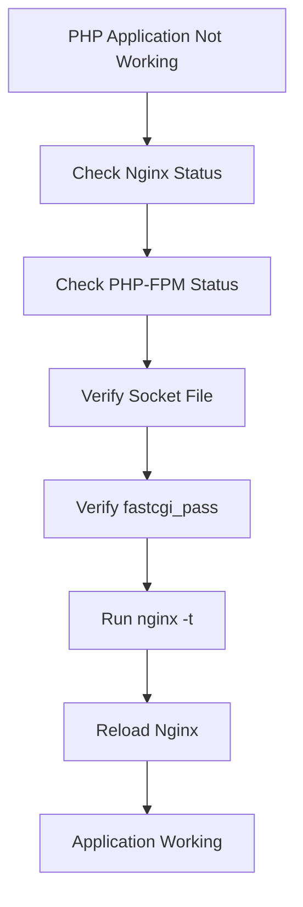
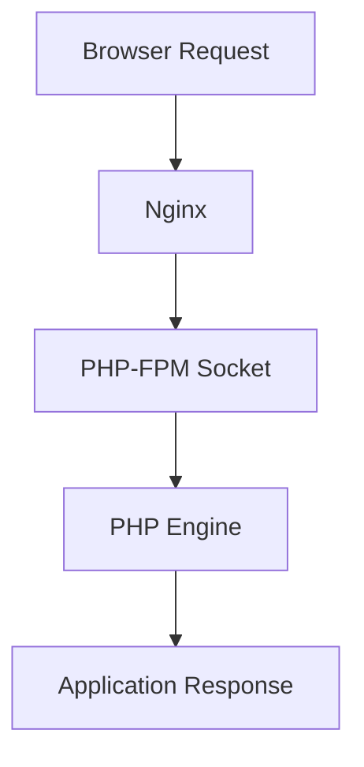

# Lab 06: Configure Nginx + PHP-FPM Using Unix Socket

## Objective

Learn how to configure Nginx and PHP-FPM to process PHP applications using a Unix Socket instead of a TCP port, resulting in improved performance and lower overhead.

By the end of this lab, you will be able to:

- Understand PHP-FPM architecture
- Understand how Nginx processes PHP requests
- Configure Nginx to communicate with PHP-FPM
- Use Unix Sockets for better performance
- Verify PHP processing
- Troubleshoot PHP-FPM connectivity issues
- Understand real-world PHP hosting architecture

---

# What is PHP-FPM?

PHP-FPM stands for:

```text
PHP FastCGI Process Manager
```

PHP-FPM is a service that executes PHP code and returns the results to a web server.

Without PHP-FPM:

```text
Nginx
   ↓
Cannot Execute PHP
```

Unlike Apache, Nginx cannot interpret PHP files directly.

Nginx requires:

```text
Nginx
   ↓
PHP-FPM
   ↓
PHP Application
```

---

# Why Do We Need PHP-FPM?

When a user requests:

```text
index.php
```

Nginx forwards the request to PHP-FPM.

PHP-FPM:

```text
Executes PHP
Processes Logic
Connects To Database
Generates Output
```

Returns the response back to Nginx.

---

# Traditional PHP Request Flow

```text
Browser
   ↓
Nginx
   ↓
PHP-FPM
   ↓
PHP Application
   ↓
Database
```

---

# What is a Unix Socket?

A Unix Socket is a special file that allows processes on the same server to communicate efficiently.

Example:

```text
/var/run/php/php8.1-fpm.sock
```

Instead of using:

```text
127.0.0.1:9000
```

the processes communicate through:

```text
php8.1-fpm.sock
```

---

# TCP vs Unix Socket

## TCP Method

```text
Nginx
   ↓
127.0.0.1:9000
   ↓
PHP-FPM
```

Requires:

```text
Network Stack
Socket Handling
TCP Overhead
```

---

## Unix Socket Method

```text
Nginx
   ↓
php8.1-fpm.sock
   ↓
PHP-FPM
```

Benefits:

```text
Faster
Lower Latency
Less CPU Usage
```

---

# Why Use Unix Sockets?

Advantages:

✅ Faster local communication

✅ Reduced network overhead

✅ Better performance

✅ Common production configuration

✅ Improved PHP response time

---

# Verify PHP-FPM Installation

Check service:

```bash
systemctl status php8.1-fpm
```

Example:

```text
active (running)
```

---

# Verify Socket File

Check:

```bash
ls -l /var/run/php/
```

Example:

```text
php8.1-fpm.sock
```

---

# Understanding the Nginx Configuration

```nginx
location ~ \.php$ {

    include snippets/fastcgi-php.conf;

    fastcgi_pass unix:/var/run/php/php8.1-fpm.sock;

}
```

---

# Understanding Each Line

## location ~ \.php$

```nginx
location ~ \.php$
```

Meaning:

```text
Match All PHP Files
```

Examples:

```text
index.php
login.php
admin.php
```

---

## include

```nginx
include snippets/fastcgi-php.conf;
```

Loads standard FastCGI settings.

Provides:

```text
PHP Variables
Request Handling
FastCGI Parameters
```

---

## fastcgi_pass

```nginx
fastcgi_pass unix:/var/run/php/php8.1-fpm.sock;
```

Forward PHP requests to:

```text
PHP-FPM Socket
```

---

# Full Example Configuration

```nginx
server {

    listen 80;

    root /var/www/html;

    index index.php index.html;

    location / {
        try_files $uri $uri/ =404;
    }

    location ~ \.php$ {

        include snippets/fastcgi-php.conf;

        fastcgi_pass unix:/var/run/php/php8.1-fpm.sock;
    }
}
```

---

# Verify Nginx Configuration

Before restart:

```bash
nginx -t
```

Expected:

```text
syntax is ok
test is successful
```

---

# Why Run nginx -t?

Prevents outages due to:

```text
Syntax Errors
Missing Files
Wrong Paths
```

Never restart without validation.

---

# Reload Nginx

Apply changes:

```bash
systemctl reload nginx
```

or

```bash
systemctl restart nginx
```

---

# Create a PHP Test File

Create:

```bash
vi /var/www/html/info.php
```

Contents:

```php
<?php
phpinfo();
?>
```

---

# Test PHP Processing

Open:

```text
http://server-ip/info.php
```

Expected:

```text
PHP Information Page
```

This confirms:

```text
Nginx → PHP-FPM → PHP
```

communication is working.

---

# Verify Running Services

Check Nginx:

```bash
systemctl status nginx
```

---

Check PHP-FPM:

```bash
systemctl status php8.1-fpm
```

---

Expected:

```text
active (running)
```

---

# Verify Listening Port

Check HTTP:

```bash
ss -tulpn | grep :80
```

Expected:

```text
LISTEN
```

---

# Verify PHP-FPM Socket

Check:

```bash
ls -l /var/run/php/
```

Expected:

```text
php8.1-fpm.sock
```

---

# Common PHP-FPM Versions

Examples:

```text
php7.4-fpm.sock
php8.0-fpm.sock
php8.1-fpm.sock
php8.2-fpm.sock
```

The version in:

```nginx
fastcgi_pass
```

must match the installed PHP version.

---

# Check Installed Version

```bash
php -v
```

Example:

```text
PHP 8.1
```

Verify:

```text
php8.1-fpm.sock
```

exists.

---

# Real-World Architecture

```text
Browser
    ↓
Nginx
    ↓
PHP-FPM Socket
    ↓
PHP Application
    ↓
Database
```

Used by:

```text
WordPress
Laravel
Magento
Drupal
Custom PHP Applications
```

---

# Common Troubleshooting Scenarios

---

# Scenario 1: 502 Bad Gateway

Error:

```text
502 Bad Gateway
```

---

## Investigation

Check PHP-FPM:

```bash
systemctl status php8.1-fpm
```

Output:

```text
inactive
```

---

## Root Cause

PHP-FPM stopped.

---

## Fix

```bash
systemctl restart php8.1-fpm
```

---

# Scenario 2: Socket File Missing

Check:

```bash
ls /var/run/php/
```

No socket file.

---

## Root Cause

PHP-FPM not running.

---

## Fix

```bash
systemctl start php8.1-fpm
```

---

# Scenario 3: Wrong PHP Version

Configuration:

```nginx
fastcgi_pass unix:/var/run/php/php8.1-fpm.sock;
```

System:

```text
PHP 8.2 Installed
```

Socket:

```text
php8.2-fpm.sock
```

---

## Fix

Update configuration:

```nginx
fastcgi_pass unix:/var/run/php/php8.2-fpm.sock;
```

Reload Nginx.

---

# Scenario 4: Permission Denied

Nginx error log:

```text
Permission denied
```

---

## Verify Ownership

```bash
ls -l /var/run/php/
```

Ensure Nginx can access the socket.

---

# Scenario 5: PHP File Downloads Instead Of Executes

User accesses:

```text
info.php
```

Browser downloads file.

---

## Root Cause

PHP location block missing.

---

## Fix

Add:

```nginx
location ~ \.php$
```

configuration.

Reload Nginx.

---

# Nginx + PHP-FPM Troubleshooting Flow



---

# Request Processing Flow



---


