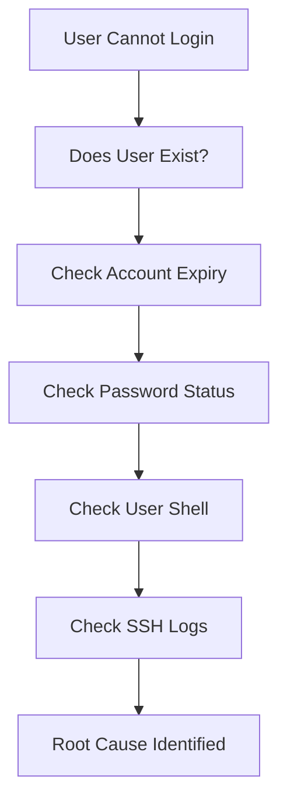
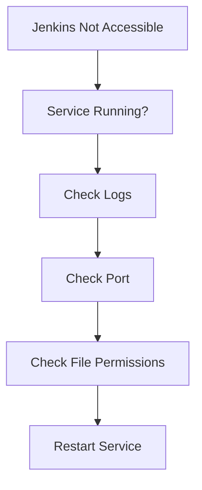
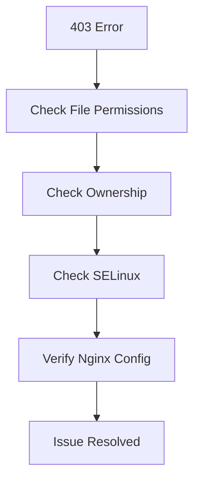
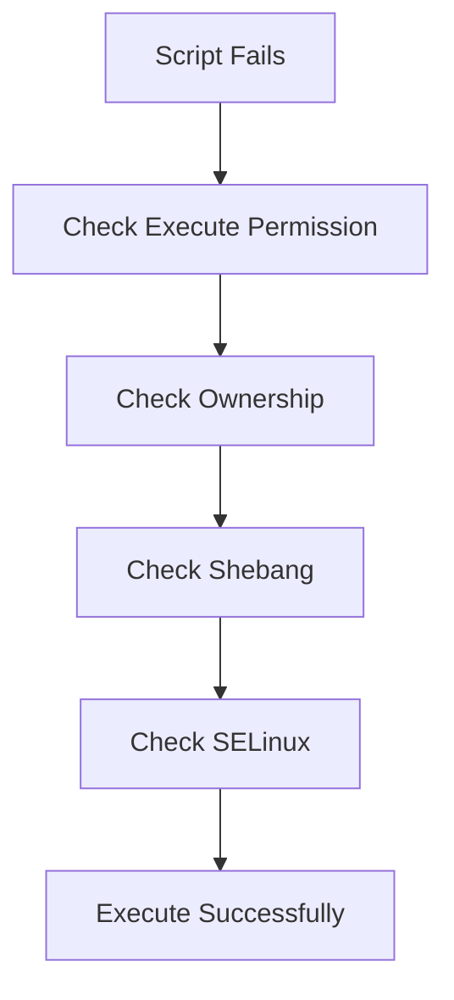
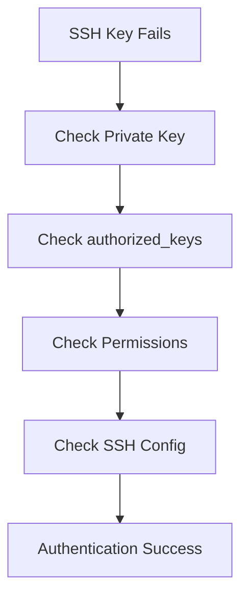
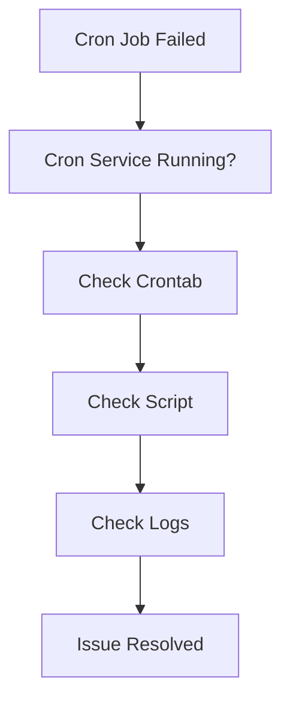
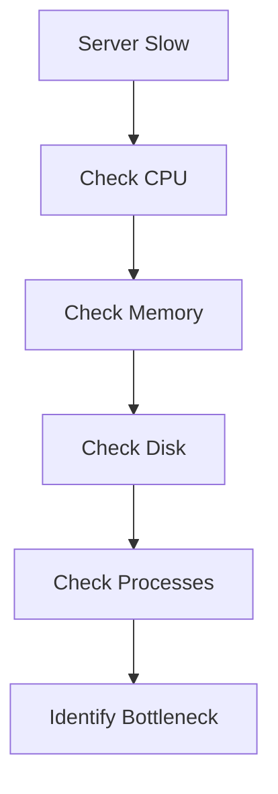
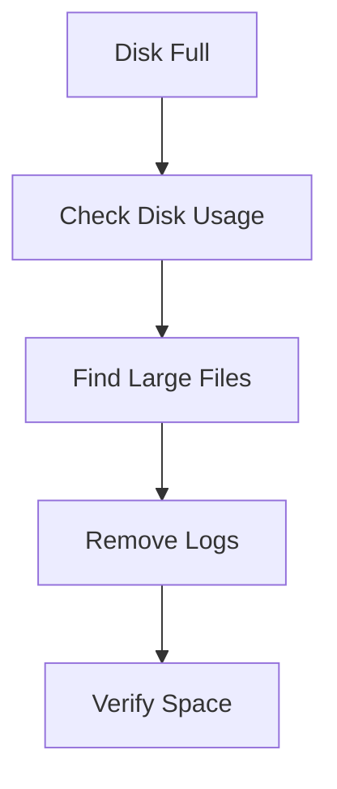

# Linux Administration Scenarios & Troubleshooting Guide

## Purpose

This document contains real-world Linux administration scenarios that frequently occur in production environments.

Focus Areas:

- User Management
- SSH
- Permissions
- Services
- Cron Jobs
- SELinux
- Script Execution
- System Access

---

# Linux Troubleshooting Mindset

Before fixing anything:

```text
Observe
   ↓
Verify
   ↓
Collect Evidence
   ↓
Identify Root Cause
   ↓
Implement Fix
   ↓
Verify Resolution
```

Never guess.

Always verify.

---

# Scenario 1: User Cannot Login

## Problem

User reports:

```text
I cannot SSH into the server.
```

---

## Troubleshooting Flow



---

## Step 1

Check user:

```bash
id username
```

---

## Step 2

Check expiry:

```bash
chage -l username
```

---

## Step 3

Check password:

```bash
passwd -S username
```

---

## Step 4

Check shell:

```bash
grep username /etc/passwd
```

Verify:

```text
/bin/bash
```

or

```text
/sbin/nologin
```

---

## Step 5

Check SSH logs:

```bash
journalctl -u sshd
```

---

# Scenario 2: Jenkins Service Failed

## Problem

Jenkins UI inaccessible.

---

## Troubleshooting Flow



---

## Verify Service

```bash
systemctl status jenkins
```

---

## Check Logs

```bash
journalctl -u jenkins
```

---

## Check Listening Port

```bash
ss -tulpn | grep 8080
```

---

## Verify Ownership

```bash
ls -ld /var/lib/jenkins
```

Expected:

```text
jenkins jenkins
```

---

# Scenario 3: Nginx Website Returns 403

## Problem

Website accessible but returns:

```text
403 Forbidden
```

---

## Troubleshooting Flow



---

## Check Permissions

```bash
ls -l /var/www/html
```

---

## Check SELinux

```bash
sestatus
```

For testing:

```bash
setenforce 0
```

If website works:

```text
SELinux likely caused issue
```

---

# Scenario 4: Script Gives Permission Denied

## Problem

```bash
./backup.sh
```

Output:

```text
Permission denied
```

---

## Troubleshooting Flow



---

## Verify Permission

```bash
ls -l backup.sh
```

Missing:

```text
x
```

---

## Fix

```bash
chmod +x backup.sh
```

---

## Verify Shebang

```bash
#!/bin/bash
```

---

# Scenario 5: SSH Key Authentication Fails

## Problem

```bash
Permission denied (publickey)
```

---

## Troubleshooting Flow



---

## Verify SSH Directory

```bash
ls -ld ~/.ssh
```

Expected:

```text
700
```

---

## Verify Authorized Keys

```bash
ls -l ~/.ssh/authorized_keys
```

Expected:

```text
600
```

---

## Debug SSH

```bash
ssh -v user@server
```

---

# Scenario 6: Cron Job Not Running

## Problem

Expected backup did not execute.

---

## Troubleshooting Flow



---

## Verify Cron Service

```bash
systemctl status crond
```

---

## View Jobs

```bash
crontab -l
```

---

## Run Script Manually

```bash
./backup.sh
```

---

## Review Logs

```bash
cat /var/log/cron_output.log
```

---

# Scenario 7: User Suddenly Lost Access

## Problem

Contractor says:

```text
Login worked yesterday but fails today.
```

---

## Investigation

Check:

```bash
chage -l contractor
```

Possible result:

```text
Account expires: Aug 07, 2026
```

Today's date:

```text
Aug 08, 2026
```

Root Cause:

```text
Account Expired
```

---

## Fix

```bash
sudo usermod -e 2026-12-31 contractor
```

---

# Scenario 8: Root Login No Longer Works

## Problem

Admin cannot login using:

```bash
ssh root@server
```

---

## Investigation

Check:

```bash
cat /etc/ssh/sshd_config
```

Find:

```text
PermitRootLogin no
```

This is expected.

---

## Recommended Access

```bash
ssh adminuser@server
```

Then:

```bash
sudo -i
```

---

# Scenario 9: Server Running Slow

## Symptoms

```text
High CPU
Slow Response
Application Delay
```

---

## Troubleshooting Flow



---

## CPU

```bash
top
```

or

```bash
htop
```

---

## Memory

```bash
free -h
```

---

## Disk

```bash
df -h
```

---

## Processes

```bash
ps aux --sort=-%cpu
```

---

# Scenario 10: Disk Full

## Symptoms

```text
Application Crashes
Unable To Write Files
Database Errors
```

---

## Troubleshooting Flow



---

## Check Disk Space

```bash
df -h
```

---

## Find Large Directories

```bash
du -sh /*
```

---

## Find Large Files

```bash
find / -type f -size +500M
```

---

# Golden Rules of Linux Troubleshooting

## Rule 1

Never change configuration before taking a backup.

```bash
cp file.conf file.conf.bak
```

---

## Rule 2

Read logs first.

```bash
journalctl
```

```bash
/var/log/*
```

---

## Rule 3

Verify assumptions.

Do not assume:

```text
Service is running
```

Check:

```bash
systemctl status service
```

---

## Rule 4

Test one change at a time.

Avoid changing multiple settings simultaneously.

---

## Rule 5

Always validate fixes.

Example:

```bash
sshd -t
```

before restarting SSH.

---

# DevOps Troubleshooting Formula

Whenever something fails:

```text
Service
   ↓
Logs
   ↓
Permissions
   ↓
Network
   ↓
Authentication
   ↓
Security Controls
   ↓
Root Cause
```

This simple framework works for Linux, Docker, Kubernetes, Jenkins, Terraform, and cloud platforms.
