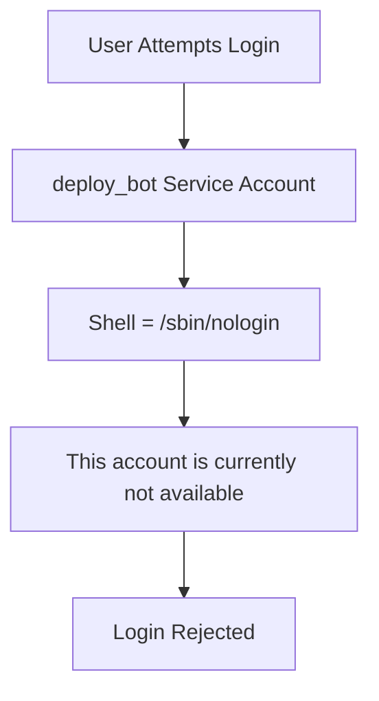

# Lab 01: Linux User Setup with Non-Interactive Shell

## Objective

Create a Linux service account that can own files and run processes but cannot be used for interactive login.

---

# Understanding Linux Users

Linux is a multi-user operating system.

Every file, process, and resource in Linux belongs to a user and group.

Examples:

```text
root
asritha
jenkins
nginx
mysql
postgres
```

Linux users are generally classified into:

## 1. Human Users

Users that log into the system and perform work.

Examples:

```text
developer
admin
asritha
john
```

Characteristics:

- Can log in using SSH
- Receive a shell after login
- Execute commands manually

Example:

```bash
ssh asritha@server
```

---

## 2. Service Users

Users created specifically for applications and services.

Examples:

```text
jenkins
nginx
mysql
apache
postgres
```

Characteristics:

- Own application files
- Run application processes
- Usually cannot log in interactively

Example:

```text
jenkins owns Jenkins files
mysql owns database files
nginx owns web server files
```

---

# What Is a Shell?

A shell is a program that allows users to interact with the Linux operating system.

Examples:

```bash
/bin/bash
/bin/sh
/bin/zsh
```

The shell acts as an interface between the user and the Linux kernel.

## Architecture

```text
User
 ↓
Shell (bash)
 ↓
Linux Kernel
 ↓
Hardware
```

Without a shell, a user cannot execute commands interactively.

---

# Interactive vs Non-Interactive Shell

## Interactive Shell

Allows users to log in and execute commands.

Example:

```bash
/bin/bash
```

User can execute commands such as:

```bash
pwd
ls
cd
mkdir
rm
```

Example user entry:

```text
john:x:1001:1001::/home/john:/bin/bash
```

---

## Non-Interactive Shell

Prevents users from obtaining a command prompt.

Examples:

```bash
/sbin/nologin
/usr/sbin/nologin
```

Example user entry:

```text
deploy_bot:x:1002:1002::/home/deploy_bot:/sbin/nologin
```

If login is attempted:

```bash
su - deploy_bot
```

Output:

```text
This account is currently not available.
```

---

# Why Do Service Accounts Use Non-Interactive Shells?

Applications require user identities to:

- Own files
- Run processes
- Access resources

However, human users should not directly log into application accounts.

### Without Non-Interactive Shell

```text
jenkins
   ↓
Can own files
Can run processes
Can login
```

Security Risk ❌

### With Non-Interactive Shell

```text
jenkins
   ↓
Can own files
Can run processes
Cannot login
```

More Secure ✅

---

# Creating a Normal User

Create a standard Linux user:

```bash
sudo useradd -m -s /bin/bash john
```

### Explanation

```text
-m  Create home directory
-s  Assign login shell
```

Verify:

```bash
grep john /etc/passwd
```

Output:

```text
john:x:1001:1001::/home/john:/bin/bash
```

---

# Creating a Service User

Create a non-interactive service account:

```bash
sudo useradd -m -s /sbin/nologin deploy_bot
```

Verify:

```bash
grep deploy_bot /etc/passwd
```

Output:

```text
deploy_bot:x:1002:1002::/home/deploy_bot:/sbin/nologin
```

---

# Modifying an Existing User

Suppose the user already exists.

Change its shell:

```bash
sudo usermod -s /sbin/nologin deploy_bot
```

Verify:

```bash
getent passwd deploy_bot
```

Output:

```text
deploy_bot:x:1002:1002::/home/deploy_bot:/sbin/nologin
```

---

# Viewing Available Shells

To view all valid shells:

```bash
cat /etc/shells
```

Example:

```text
/bin/sh
/bin/bash
/bin/dash
/usr/bin/zsh
/sbin/nologin
```

---

# Why Not Use /bin/false?

Alternative:

```bash
useradd -s /bin/false deploy_bot
```

Both prevent login.

### /bin/false

```text
Login
 ↓
Immediate Exit
```

No message displayed.

### /sbin/nologin

```text
Login
 ↓
This account is currently not available
 ↓
Exit
```

Provides a user-friendly message and is generally preferred.

---

# Testing the Service User

Attempt login:

```bash
su - deploy_bot
```

Expected Output:

```text
This account is currently not available.
```

This confirms the account cannot be used interactively.

---

# How Services Run Using Service Accounts

Example:

```bash
systemctl start nginx
```

Linux starts nginx using its service account.

Check running process:

```bash
ps -ef | grep nginx
```

Output:

```text
nginx  1234 ...
```

Although the nginx user cannot log in, the nginx process runs successfully.

---

# Troubleshooting Service Failures

A common misconception is:

> If the account cannot log in, how can administrators troubleshoot?

Administrators do not log in as service accounts.

Instead, they use their own administrative account.

---

## Step 1: Check Service Status

Example:

```bash
systemctl status nginx
systemctl status jenkins
systemctl status mysql
```

Possible Output:

```text
Active: failed
```

---

## Step 2: Check Service Logs

### Jenkins

```bash
journalctl -u jenkins
```

### Nginx

```bash
tail -f /var/log/nginx/error.log
```

### MySQL

```bash
journalctl -u mysql
```

Logs usually reveal the root cause of failures.

---

## Step 3: Check Running Processes

```bash
ps -ef | grep jenkins
```

Example:

```text
jenkins 1234 ...
```

This confirms whether the service process is running.

---

## Step 4: Verify File Ownership

Example:

```bash
ls -ld /var/lib/jenkins
```

Output:

```text
drwxr-xr-x jenkins jenkins
```

Incorrect ownership frequently causes service failures.

---

## Step 5: Execute Commands as Service User

Run a single command as the service account.

Example:

```bash
sudo -u jenkins whoami
```

Output:

```text
jenkins
```

Example:

```bash
sudo -u nginx ls /var/www/html
```

Useful for permission troubleshooting.

---

## Step 6: Temporary Shell Access for Debugging

For advanced debugging:

```bash
sudo su -s /bin/bash jenkins
```

Verify:

```bash
whoami
```

Output:

```text
jenkins
```

Exit:

```bash
exit
```

This does not permanently change the account's shell.

---

# Example Production Incident

## Problem

Jenkins service fails to start.

Check service status:

```bash
systemctl status jenkins
```

Output:

```text
Failed to start Jenkins
```

---

## Check Logs

```bash
journalctl -u jenkins -n 50
```

Output:

```text
Permission denied: /var/lib/jenkins
```

---

## Check Ownership

```bash
ls -ld /var/lib/jenkins
```

Output:

```text
drwxr-xr-x root root
```

Root cause identified.

---

## Fix

```bash
sudo chown -R jenkins:jenkins /var/lib/jenkins
```

Restart service:

```bash
sudo systemctl restart jenkins
```

Verify:

```bash
systemctl status jenkins
```

Output:

```text
Active: active (running)
```

Issue resolved.

---

# Workflow Diagram



---

# Key Learnings

- Linux users own files and processes
