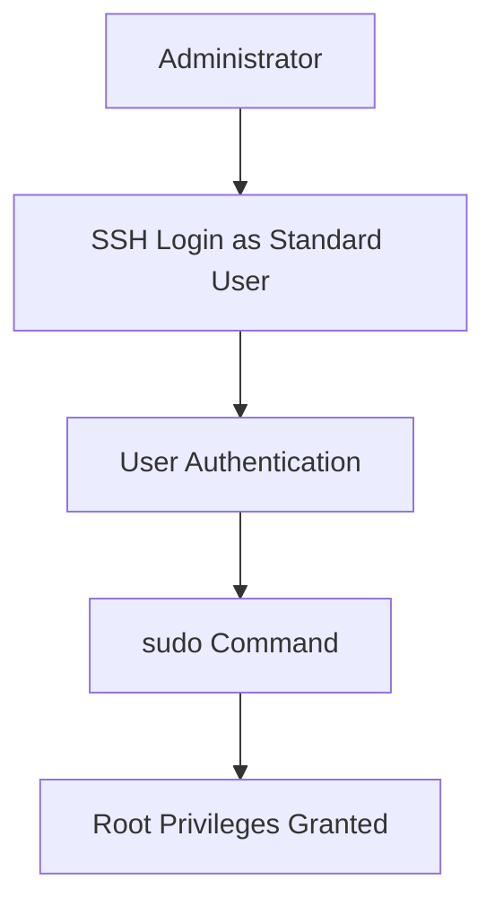

# Lab 03: Secure Root SSH Access

## Objective

Disable direct root login through SSH and enforce administrative access using standard user accounts and sudo privileges.

This is a common security hardening practice used in production Linux environments.

---

# Understanding SSH

SSH stands for:

```text
Secure Shell
```

It is a secure protocol used to access remote Linux systems.

Example:

```bash
ssh asritha@server-ip
```

SSH allows administrators to:

- Manage servers remotely
- Execute commands
- Transfer files securely
- Troubleshoot applications

---

# What is the Root User?

The root user is the Linux superuser.

Root can:

- Create users
- Delete users
- Install software
- Modify system files
- Start and stop services
- Access all files

Example:

```bash
whoami
```

Output:

```text
root
```

Because root has unrestricted power, it is the primary target for attackers.

---

# Why Is Direct Root Login Dangerous?

Consider this scenario:

```text
Internet
    ↓
Linux Server
    ↓
SSH Open
```

An attacker already knows a common username:

```text
root
```

Now they only need to guess the password.

Common attack:

```text
root + password guessing
```

Thousands of attempts can be launched automatically.

This is called a:

```text
Brute Force Attack
```

---

# Better Approach

Instead of:

```text
ssh root@server
```

Require:

```text
ssh asritha@server
```

Then:

```bash
sudo su -
```

or

```bash
sudo command
```

Benefits:

- Reduces attack surface
- Creates audit logs
- Tracks who performed actions
- Protects the root account

---

# How SSH Authentication Works

When a user connects:

```text
ssh user@server
      ↓
SSH Server
      ↓
Validate User
      ↓
Validate Password / Key
      ↓
Grant Access
```

For root:

```text
ssh root@server
```

we want:

```text
Access Denied
```

---

# SSH Configuration File

SSH server settings are stored in:

```bash
/etc/ssh/sshd_config
```

The sshd daemon reads this file whenever it starts.

View configuration:

```bash
sudo vi /etc/ssh/sshd_config
```

---

# Checking Current Root Login Configuration

Search for:

```bash
PermitRootLogin
```

Example:

```text
PermitRootLogin yes
```

Meaning:

```text
Root login allowed
```

---

# Disable Root Login

Edit:

```bash
sudo vi /etc/ssh/sshd_config
```

Change:

```text
PermitRootLogin yes
```

To:

```text
PermitRootLogin no
```

Save the file.

---

# Understanding PermitRootLogin Options

## PermitRootLogin yes

```text
Root login allowed
```

Example:

```bash
ssh root@server
```

Possible.

---

## PermitRootLogin no

```text
Root login disabled
```

Example:

```bash
ssh root@server
```

Result:

```text
Permission denied
```

---

## PermitRootLogin prohibit-password

Root login allowed only through SSH keys.

Passwords are rejected.

Example:

```text
SSH Key Login ✅

Password Login ❌
```

This is common in cloud environments.

---

# Validate SSH Configuration

Before restarting SSH:

```bash
sudo sshd -t
```

This checks syntax.

Good output:

```text
(no output)
```

No output means configuration is valid.

---

# Why Is This Important?

If configuration contains syntax errors:

```text
Wrong SSH Config
      ↓
Restart SSH
      ↓
SSH Fails To Start
      ↓
Server Becomes Inaccessible
```

Always run:

```bash
sudo sshd -t
```

before restarting.

---

# Restart SSH Service

After validation:

```bash
sudo systemctl restart sshd
```

Verify:

```bash
sudo systemctl status sshd
```

Expected:

```text
Active: active (running)
```

---

# Verify Root Login Is Blocked

From another machine:

```bash
ssh root@server-ip
```

Expected:

```text
Permission denied
```

Even with the correct password.

---

# Verify Normal User Login

Login with a standard user:

```bash
ssh asritha@server-ip
```

Expected:

```text
Login successful
```

---

# Gaining Administrative Access

After login:

```bash
sudo -i
```

or

```bash
sudo su -
```

Now:

```bash
whoami
```

Output:

```text
root
```

Administrative access still exists, but only through audited sudo usage.

---

# Why Sudo is Better Than Direct Root Login

Without sudo:

```text
root logs in
    ↓
Runs commands
    ↓
No accountability
```

Who performed the action?

Unknown.

---

With sudo:

```text
asritha logs in
      ↓
Uses sudo
      ↓
Action recorded
```

Linux records:

```text
who
what
when
```

This provides a clear audit trail.

---

# Real Production Example

Suppose three administrators manage a server:

```text
asritha
john
sarah
```

If everyone uses:

```bash
ssh root@server
```

Audit logs show:

```text
root executed command
```

Nobody knows which administrator performed the action.

---

Instead:

```bash
ssh asritha@server
sudo systemctl restart nginx
```

Logs show:

```text
asritha executed command via sudo
```

This improves accountability.

---

# Troubleshooting SSH Login Issues

## Step 1: Check SSH Service

```bash
sudo systemctl status sshd
```

Expected:

```text
active (running)
```

---

## Step 2: Check SSH Logs

RHEL/CentOS:

```bash
sudo journalctl -u sshd
```

Ubuntu:

```bash
sudo tail -f /var/log/auth.log
```

Look for:

```text
authentication failures
invalid user
permission denied
```

---

## Step 3: Validate Configuration

```bash
sudo sshd -t
```

If there's an error:

```text
Bad configuration option
```

Fix the configuration file.

---

## Step 4: Verify Sudo User Exists

Before disabling root login:

Verify:

```bash
id username
```

Example:

```bash
id asritha
```

Ensure the user exists.

---

## Step 5: Verify Sudo Access

Check:

```bash
sudo -l
```

Expected:

```text
User may run the following commands...
```

---

# Workflow Diagram



---

# Administrative Commands Summary

Check SSH config:

```bash
sudo vi /etc/ssh/sshd_config
```

Disable root login:

```text
PermitRootLogin no
```

Validate config:

```bash
sudo sshd -t
```

Restart SSH:

```bash
sudo systemctl restart sshd
```

Check status:

```bash
sudo systemctl status sshd
```

Test login:

```bash
ssh root@server-ip
```

---

# Key Learnings

- SSH enables secure remote administration.
- The root account has unrestricted privileges.
- Direct root login increases security risk.
- Attackers commonly target the root account.
- Disabling root login reduces attack surface.
- sudo provides accountability and auditing.
- Always validate SSH configuration before restarting.
- Maintain at least one sudo-enabled account before disabling root login.

---

# Interview Questions

## Why should direct root SSH login be disabled?

Because the root account is a common target for brute-force attacks. Using standard accounts with sudo improves security and auditing.

---

## Which configuration file controls SSH server behavior?

```bash
/etc/ssh/sshd_config
```

---

## Which setting disables root SSH login?

```text
PermitRootLogin no
```

---

## How do you verify SSH configuration syntax?

```bash
sudo sshd -t
```

---

## Why is sudo preferred over direct root logins?

sudo creates audit logs and identifies which user executed administrative commands.

---

## What is the risk of restarting SSH without validating configuration?

A syntax error could prevent SSH from starting, potentially locking administrators out of the server.

---
