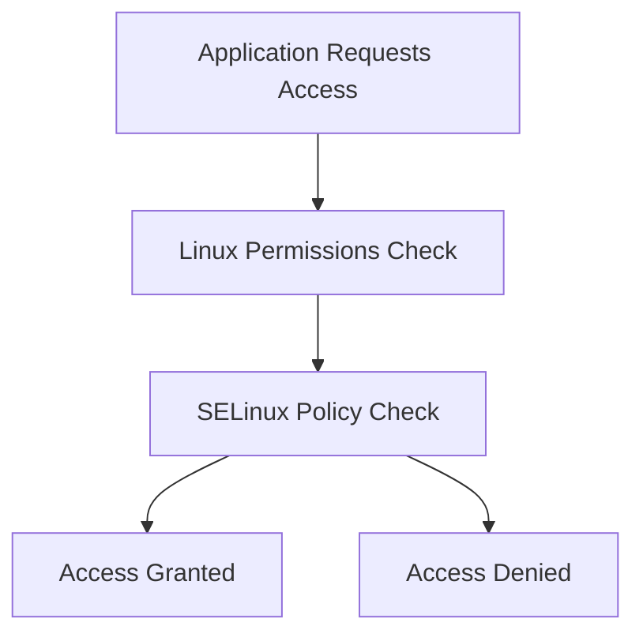

# Lab 05: SELinux Installation and Configuration

## Objective

Understand SELinux (Security-Enhanced Linux), install SELinux management tools, configure it in Enforcing mode, and learn how it protects Linux systems using Mandatory Access Control (MAC).

By the end of this lab, you will be able to:

- Understand what SELinux is
- Understand the difference between DAC and MAC
- Check SELinux status
- Enable SELinux Enforcing mode
- Make SELinux configuration persistent
- Troubleshoot SELinux-related issues
- Understand common real-world DevOps use cases

---

# What is SELinux?

SELinux stands for:

```text
Security-Enhanced Linux
```

It is an additional security layer built into Linux.

SELinux controls what processes can access, even after normal Linux permissions have been granted.

Think of SELinux as:

```text
Traditional Linux Security
            +
Additional Security Rules
            =
SELinux
```

---

# Why Was SELinux Created?

Traditional Linux security relies on:

```text
User
Groups
Permissions
Ownership
```

Example:

```text
-rwxrwxrwx
```

If a process runs as:

```text
root
```

it can potentially access almost everything.

This becomes dangerous if:

```text
Application Vulnerability
        ↓
Attacker Gains Root Access
        ↓
Entire System At Risk
```

SELinux helps limit that damage.

---

# Understanding DAC (Discretionary Access Control)

Linux normally uses:

```text
DAC
```

Discretionary Access Control.

Example:

```text
User owns file
      ↓
User decides permissions
```

Example:

```bash
chmod 777 file.txt
```

Owner chooses access.

---

## Problem with DAC

Consider:

```text
Nginx Process
      ↓
Compromised
      ↓
Runs as root
      ↓
Can Access Sensitive Files
```

DAC alone cannot stop this.

---

# Understanding MAC (Mandatory Access Control)

SELinux introduces:

```text
MAC
```

Mandatory Access Control.

Now access decisions are controlled by:

```text
System Security Policy
```

instead of individual users.

Even root can be restricted.

---

# DAC vs MAC

## DAC

```text
User Controls Access
```

Example:

```bash
chmod
chown
```

---

## MAC

```text
System Policy Controls Access
```

Even:

```text
root
```

must obey policy rules.

---

# Real-World Example

Suppose Nginx is compromised.

Without SELinux:

```text
Attacker
    ↓
Nginx
    ↓
System Files
```

Possible access.

---

With SELinux:

```text
Attacker
    ↓
Nginx
    ↓
SELinux Policy
    ↓
Access Blocked
```

Attack contained.

---

# Checking SELinux Status

Check current state:

```bash
sestatus
```

Example Output:

```text
SELinux status:                 enabled
Current mode:                   enforcing
Mode from config file:          enforcing
Policy version:                 33
```

---

# Understanding SELinux Modes

SELinux operates in three modes.

## 1. Enforcing Mode

```text
Rules Enforced
Violations Blocked
Violations Logged
```

Most secure mode.

Example:

```text
Unauthorized Access
       ↓
Blocked
```

---

## 2. Permissive Mode

```text
Rules Not Enforced
Violations Logged
```

Useful for troubleshooting.

Example:

```text
Unauthorized Access
       ↓
Allowed
       ↓
Logged
```

---

## 3. Disabled Mode

```text
No SELinux Protection
No Policy Enforcement
```

Not recommended for production.

---

# Installing SELinux Tools

Install SELinux packages:

```bash
sudo yum install selinux-policy-targeted -y
```

### Explanation

```text
yum
```

Package manager used in RHEL/CentOS systems.

---

```text
selinux-policy-targeted
```

Default SELinux policy package.

---

```text
-y
```

Automatically answer "yes" during installation.

---

# View Current Mode

Use:

```bash
getenforce
```

Example:

```text
Enforcing
```

or

```text
Permissive
```

or

```text
Disabled
```

---

# Enable SELinux Enforcing Mode

Change immediately:

```bash
sudo setenforce 1
```

Verify:

```bash
getenforce
```

Output:

```text
Enforcing
```

---

# Understanding setenforce

### Enforcing

```bash
sudo setenforce 1
```

Equivalent to:

```text
Enforcing Mode
```

---

### Permissive

```bash
sudo setenforce 0
```

Equivalent to:

```text
Permissive Mode
```

---

# Important Note

`setenforce` changes are:

```text
Temporary
```

They do not survive a reboot.

---

# Making SELinux Persistent

Edit:

```bash
sudo vi /etc/selinux/config
```

Find:

```text
SELINUX=permissive
```

or

```text
SELINUX=disabled
```

Change to:

```text
SELINUX=enforcing
```

Save the file.

---

# Verify Configuration

Check:

```bash
cat /etc/selinux/config
```

Expected:

```text
SELINUX=enforcing
```

---

# SELinux Labels and Contexts

SELinux uses labels.

View labels:

```bash
ls -Z
```

Example:

```text
-rw-r--r-- root root system_u:object_r:httpd_sys_content_t:s0 index.html
```

Notice:

```text
httpd_sys_content_t
```

This label tells SELinux:

```text
This file belongs to Apache/Nginx content.
```

---

# Why Labels Matter

Suppose a website file is copied from another location.

Wrong label:

```text
user_home_t
```

Correct label:

```text
httpd_sys_content_t
```

Nginx may fail to access the file because SELinux denies access.

---

# Troubleshooting SELinux

SELinux is often blamed when applications fail unexpectedly.

Let's learn how to investigate.

---

## Step 1: Check SELinux Status

```bash
sestatus
```

Verify:

```text
Current mode: enforcing
```

---

## Step 2: Check Audit Logs

View SELinux-related denials:

```bash
sudo grep AVC /var/log/audit/audit.log
```

Example:

```text
AVC denied
```

This indicates SELinux blocked an action.

---

## Step 3: Temporarily Switch to Permissive

For testing:

```bash
sudo setenforce 0
```

Retry application.

If it suddenly works:

```text
Problem Likely Caused By SELinux
```

---

Verify:

```bash
getenforce
```

Output:

```text
Permissive
```

---

## Step 4: Re-Enable Protection

Always restore:

```bash
sudo setenforce 1
```

Verify:

```bash
getenforce
```

Output:

```text
Enforcing
```

---

# Common DevOps Example

Suppose you deploy Nginx.

Check service:

```bash
systemctl status nginx
```

Status:

```text
active (running)
```

Website still shows:

```text
403 Forbidden
```

Permissions appear correct.

---

Check SELinux:

```bash
sestatus
```

Possible issue:

```text
Wrong SELinux Context
```

SELinux is blocking file access even though normal permissions allow it.

---

# Workflow Diagram



---

# Command Summary

Install SELinux tools:

```bash
sudo yum install selinux-policy-targeted -y
```

Check status:

```bash
sestatus
```

Check mode:

```bash
getenforce
```

Enable enforcing mode:

```bash
sudo setenforce 1
```

Enable permissive mode:

```bash
sudo setenforce 0
```

View config:

```bash
cat /etc/selinux/config
```

View security contexts:

```bash
ls -Z
```

---

# Key Learnings

- SELinux stands for Security-Enhanced Linux.
- SELinux implements Mandatory Access Control (MAC).
- MAC provides protection beyond standard Linux permissions.
- Even root users can be restricted by SELinux policies.
- Enforcing mode blocks and logs policy violations.
- Permissive mode logs violations without blocking them.
- Disabled mode provides no SELinux protection.
- `sestatus` verifies SELinux status.
- `setenforce` changes mode temporarily.
- `/etc/selinux/config` controls persistent configuration.
- SELinux is widely used in enterprise Linux environments.

---

# Interview Questions

## What is SELinux?

SELinux is a Linux security framework that implements Mandatory Access Control (MAC) to restrict process and resource access according to security policies.

---

## What problem does SELinux solve?

SELinux limits what applications and processes can access, reducing the impact of security breaches and compromised services.

---

## What are the three SELinux modes?

1. Enforcing
2. Permissive
3. Disabled

---

## Which command shows SELinux status?

```bash
sestatus
```

---

## Which command shows the current mode?

```bash
getenforce
```

---

## How do you switch SELinux to enforcing mode?

```bash
sudo setenforce 1
```

---

## How do you make SELinux enforcing after reboot?

Edit:

```bash
/etc/selinux/config
```

Set:

```text
SELINUX=enforcing
```

---

## What is the difference between DAC and MAC?

### DAC

Users control file permissions.

Example:

```bash
chmod
chown
```

### MAC

The operating system's security policy controls access.

Even root must follow policy rules.

---

## What should you check if an application works in permissive mode but fails in enforcing mode?

Review SELinux audit logs and file contexts because SELinux is likely blocking required access.

---
