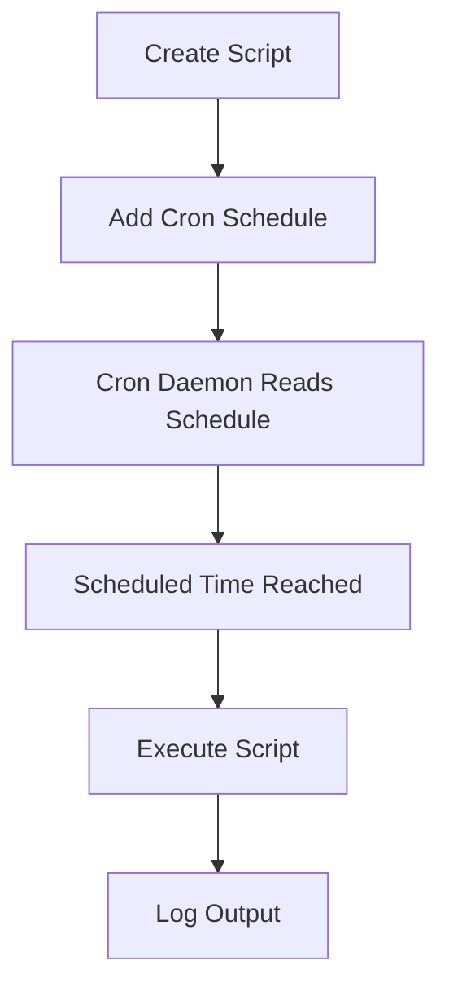

# Lab 06: Create a Cron Job

## Objective

Learn how to automate recurring tasks in Linux using Cron.

By the end of this lab, you will be able to:

- Understand what Cron is
- Create scheduled jobs
- Read cron expressions
- Verify cron execution
- Troubleshoot failed cron jobs
- Apply cron in real-world DevOps scenarios

---

# What is Cron?

Cron is a Linux job scheduler.

It allows tasks to run automatically at a specific time or interval without human intervention.

Think of Cron as Linux's built-in scheduler.

```text
Cron
 ↓
Runs Commands Automatically
 ↓
At Scheduled Times
```

---

# Why Do We Need Cron?

In production environments, many tasks are repetitive.

Examples:

### Backup Operations

```text
Daily Database Backup
```

### Log Rotation

```text
Delete Logs Older Than 30 Days
```

### Monitoring

```text
Check Disk Usage Every Hour
```

### Synchronization

```text
Sync Files Every 15 Minutes
```

### Reporting

```text
Generate Daily Reports
```

Manually performing these tasks is inefficient and error-prone.

Cron automates them.

---

# Understanding the Cron Architecture

```text
Cron Daemon (crond)
          ↓
Reads Cron Schedule
          ↓
Checks Current Time
          ↓
Runs Scheduled Commands
```

The Cron daemon runs continuously in the background.

---

# What is a Cron Daemon?

A daemon is a background process.

Examples:

```text
sshd
httpd
nginx
crond
```

Cron runs as:

```text
crond
```

Verify:

```bash
systemctl status crond
```

Output:

```text
Active: active (running)
```

---

# What is crontab?

Crontab stands for:

```text
Cron Table
```

It contains the schedule of commands that Cron should execute.

Each user can have their own crontab.

Example:

```text
root
ubuntu
jenkins
```

can all have separate schedules.

---

# Editing a User's Crontab

Open the scheduler:

```bash
crontab -e
```

The editor opens.

You can then add jobs.

---

# Creating a Daily Backup Job

Example:

```bash
0 0 * * * /home/ubuntu/scripts/daily_backup.sh
```

This runs:

```text
Every Day
At Midnight
```

---

# Understanding Cron Syntax

A cron entry contains:

```text
* * * * * command
│ │ │ │ │
│ │ │ │ └── Day of Week
│ │ │ └──── Month
│ │ └────── Day of Month
│ └──────── Hour
└────────── Minute
```

---

# Field Explanations

## Minute

Range:

```text
0-59
```

Example:

```text
30
```

Runs at minute 30.

---

## Hour

Range:

```text
0-23
```

Example:

```text
2
```

Runs at 2 AM.

---

## Day of Month

Range:

```text
1-31
```

Example:

```text
15
```

Runs on the 15th.

---

## Month

Range:

```text
1-12
```

Example:

```text
12
```

Runs in December.

---

## Day of Week

Range:

```text
0-7
```

Where:

```text
0 = Sunday
1 = Monday
...
6 = Saturday
7 = Sunday
```

---

# Breaking Down the Example

```bash
0 0 * * * /home/ubuntu/scripts/daily_backup.sh
```

Meaning:

```text
Minute  = 0
Hour    = 0
Day     = *
Month   = *
Weekday = *
```

Result:

```text
Run Every Day At Midnight
```

---

# Common Cron Examples

## Every Hour

```bash
0 * * * * command
```

---

## Every Day at 2 AM

```bash
0 2 * * * command
```

---

## Every Sunday at Midnight

```bash
0 0 * * 0 command
```

---

## Every 15 Minutes

```bash
*/15 * * * * command
```

---

## Every 5 Minutes

```bash
*/5 * * * * command
```

---

## Every Month on the 1st

```bash
0 0 1 * * command
```

---

# Importance of Absolute Paths

One of the most common Cron mistakes.

Bad:

```bash
python backup.py
```

Cron may fail because:

```text
python not found
```

---

Good:

```bash
/usr/bin/python3 /home/ubuntu/scripts/backup.py
```

Absolute paths remove ambiguity.

---

# Why Does Cron Need Absolute Paths?

Cron runs with a minimal environment.

Your interactive shell contains variables like:

```bash
PATH
HOME
USER
```

Cron often lacks these.

Example:

```bash
which python3
```

Output:

```text
/usr/bin/python3
```

Use that absolute path.

---

# Logging Cron Output

Always capture output.

Example:

```bash
0 0 * * * /home/ubuntu/scripts/daily_backup.sh >> /var/log/cron_output.log 2>&1
```

---

# Understanding the Redirection

### Standard Output

```text
stdout
```

Redirect:

```bash
>>
```

Append output to file.

---

### Standard Error

```text
stderr
```

Redirect:

```bash
2>&1
```

Send errors to the same log file.

---

Result:

```text
Normal Messages
Errors
```

Both stored in:

```text
/var/log/cron_output.log
```

---

# Listing Existing Cron Jobs

View current jobs:

```bash
crontab -l
```

Example:

```text
0 0 * * * /home/ubuntu/scripts/daily_backup.sh
```

---

# Removing Cron Jobs

Edit:

```bash
crontab -e
```

Delete the line.

Save and exit.

---

# Removing Entire Crontab

Be careful:

```bash
crontab -r
```

This removes all cron jobs for the user.

---

# Real DevOps Examples

## Database Backup

```bash
0 0 * * * /scripts/db_backup.sh
```

---

## Cleanup Logs

```bash
0 1 * * 0 /scripts/cleanup_logs.sh
```

---

## Monitor Disk Usage

```bash
*/15 * * * * /scripts/check_disk.sh
```

---

## Restart Service Weekly

```bash
0 3 * * 7 systemctl restart app
```

---

# Troubleshooting Cron Jobs

Suppose:

```text
Cron Job Didn't Run
```

Follow these steps.

---

## Step 1: Check Cron Service

```bash
systemctl status crond
```

Expected:

```text
active (running)
```

---

## Step 2: Verify Cron Entry

```bash
crontab -l
```

Ensure schedule is correct.

---

## Step 3: Check Log File

```bash
cat /var/log/cron_output.log
```

Look for:

```text
Permission denied
File not found
Command not found
```

---

## Step 4: Verify Script Permissions

Check:

```bash
ls -l daily_backup.sh
```

Expected:

```text
-rwxr-xr-x
```

If not executable:

```bash
chmod +x daily_backup.sh
```

---

## Step 5: Run Script Manually

Execute:

```bash
./daily_backup.sh
```

If it fails manually:

```text
Cron is not the problem.
```

Fix the script first.

---

## Step 6: Check Absolute Paths

Bad:

```bash
python backup.py
```

Good:

```bash
/usr/bin/python3 /home/ubuntu/scripts/backup.py
```

---

## Step 7: Check Cron Logs

RHEL/CentOS:

```bash
grep CRON /var/log/cron
```

Ubuntu:

```bash
grep CRON /var/log/syslog
```

Look for execution records.

---

# Workflow Diagram



---

# Command Summary

Open Cron Editor:

```bash
crontab -e
```

View Existing Jobs:

```bash
crontab -l
```

Remove All Jobs:

```bash
crontab -r
```

Daily Midnight Backup:

```bash
0 0 * * * /home/ubuntu/scripts/daily_backup.sh
```

Daily Backup With Logging:

```bash
0 0 * * * /home/ubuntu/scripts/daily_backup.sh >> /var/log/cron_output.log 2>&1
```

Check Cron Service:

```bash
systemctl status crond
```

---

# Key Learnings

- Cron automates repetitive Linux tasks.
- Cron jobs are stored in a user's crontab.
- Cron syntax consists of five scheduling fields.
- `crontab -e` edits schedules.
- `crontab -l` lists schedules.
- Always use absolute paths in cron jobs.
- Capture logs for troubleshooting.
- Verify script permissions before scheduling.
- Cron is heavily used in DevOps automation and server maintenance.

---

# Interview Questions

## What is Cron?

Cron is a Linux scheduling service used to automatically execute commands or scripts at predefined times.

---

## What command is used to create or edit cron jobs?

```bash
crontab -e
```

---

## How do you view existing cron jobs?

```bash
crontab -l
```

---

## What does this expression mean?

```bash
0 0 * * *
```

Run every day at midnight.

---

## Why should absolute paths be used in cron jobs?

Because Cron runs with a minimal environment and may not have the same PATH variables as an interactive shell.

---

## How do you capture both output and errors from a cron job?

```bash
>> /var/log/cron_output.log 2>&1
```

---

## How would you troubleshoot a cron job that is not running?

1. Verify cron service is running.
2. Check cron schedule.
3. Review logs.
4. Verify script permissions.
5. Run the script manually.
6. Verify absolute paths.
7. Check system cron logs.

---

## Difference Between Cron and Manual Execution?

Manual execution requires human intervention.

Cron execution is automatic and scheduled, making it ideal for automation and DevOps operations.

---
